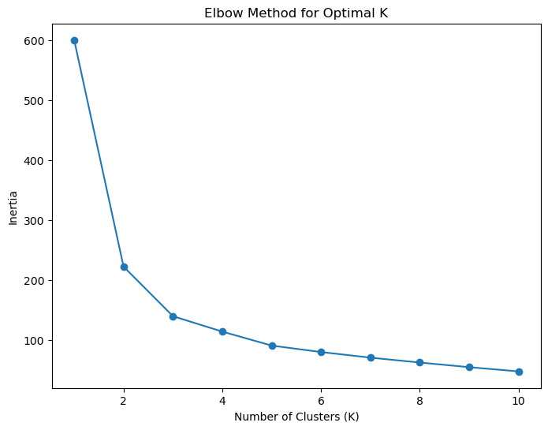
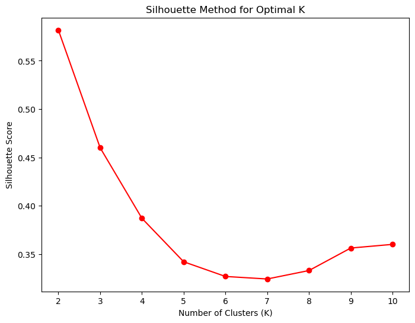

# 📖 فصل سوم: انتخاب تعداد خوشه‌ها (K)

انتخاب مقدار درست برای $K$ در الگوریتم K-Means یک موضوع حیاتی است. اگر $K$ خیلی کم یا زیاد باشد، خوشه‌ها معنای واقعی خود را از دست می‌دهند.

---

## 🔹 روش اول: Elbow Method

در این روش، برای مقادیر مختلف $K$ مجموع مربعات خطاها (Inertia) را محاسبه می‌کنیم.

$$
\text{Inertia} = \sum_{i=1}^K \sum_{x \in C_i} ||x - \mu_i||^2
$$

سپس نمودار $K$ در برابر Inertia رسم می‌کنیم. نقطه‌ای که کاهش Inertia کندتر می‌شود (مثل یک آرنج/Elbow) بهترین مقدار $K$ است.

```python
inertias = []
K_range = range(1, 11)

for k in K_range:
    kmeans = KMeans(n_clusters=k, random_state=42)
    kmeans.fit(X_scaled)
    inertias.append(kmeans.inertia_)

plt.figure(figsize=(8,6))
plt.plot(K_range, inertias, marker="o")
plt.xlabel("Number of Clusters (K)")
plt.ylabel("Inertia")
plt.title("Elbow Method for Optimal K")
plt.show()
```


📌 در دیتاست Iris معمولاً بهترین مقدار $K=3$ مشخص می‌شود.

---

## 🔹 روش دوم: Silhouette Score

این روش کیفیت خوشه‌بندی را بر اساس میزان نزدیکی نقاط به خوشه‌ی خودشان و فاصله از خوشه‌های دیگر می‌سنجد.

فرمول:

$$
s(i) = \frac{b(i) - a(i)}{\max(a(i), b(i))}
$$

* $a(i)$: میانگین فاصله نقطه $i$ از سایر نقاط در همان خوشه
* $b(i)$: کمترین میانگین فاصله نقطه $i$ از نقاط خوشه‌های دیگر

مقدار $s(i)$ بین -۱ و ۱ است. هرچه بالاتر باشد، خوشه‌بندی بهتر است.

```python
from sklearn.metrics import silhouette_score

silhouette_scores = []
for k in range(2, 11):
    kmeans = KMeans(n_clusters=k, random_state=42)
    labels = kmeans.fit_predict(X_scaled)
    silhouette_scores.append(silhouette_score(X_scaled, labels))

plt.figure(figsize=(8,6))
plt.plot(range(2, 11), silhouette_scores, marker="o", color="red")
plt.xlabel("Number of Clusters (K)")
plt.ylabel("Silhouette Score")
plt.title("Silhouette Method for Optimal K")
plt.show()
```




📌 در دیتاست Iris معمولاً مقدار $K=3$ بالاترین **Silhouette Score** را دارد.

---

## ✨ نتیجه‌گیری فصل سوم

* روش Elbow کمک می‌کند بفهمیم بعد از چه مقداری از $K$ کاهش Inertia خیلی کم می‌شود.
* روش Silhouette به ما نشان می‌دهد که کیفیت خوشه‌ها چطور تغییر می‌کند.
* در دیتاست Iris هر دو روش تأیید می‌کنند که بهترین مقدار خوشه‌ها **۳** است.

