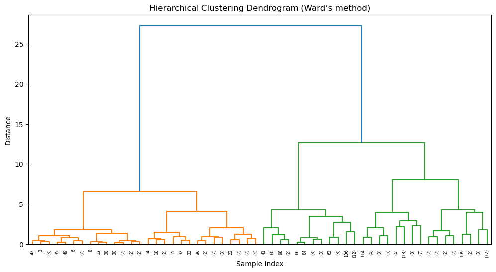

# 📖 فصل چهارم: خوشه‌بندی سلسله‌مراتبی (Hierarchical Clustering)

برخلاف K-Means که تعداد خوشه‌ها را از قبل مشخص می‌کردیم، در خوشه‌بندی سلسله‌مراتبی داده‌ها به‌صورت **درختی** گروه‌بندی می‌شوند.

---

## 🔹 ایده اصلی

* ابتدا هر داده یک خوشه جداگانه است.
* در هر مرحله، دو خوشه‌ای که بیشترین شباهت (یا کمترین فاصله) را دارند، ترکیب می‌شوند.
* این روند تا زمانی ادامه می‌یابد که همه داده‌ها در یک خوشه قرار گیرند.
* نتیجه نهایی با **دندروگرام (Dendrogram)** نمایش داده می‌شود.

---

## 📐 معیارهای فاصله

در خوشه‌بندی سلسله‌مراتبی چند روش برای محاسبه فاصله بین خوشه‌ها وجود دارد:

* **Single Linkage**: کمترین فاصله بین اعضای دو خوشه
* **Complete Linkage**: بیشترین فاصله بین اعضای دو خوشه
* **Average Linkage**: میانگین فاصله‌ها
* **Ward’s Method**: کمینه کردن واریانس بین خوشه‌ها (پرکاربردترین روش)

---

## 📊 پیاده‌سازی روی دیتاست Iris

```python
from scipy.cluster.hierarchy import dendrogram, linkage
import matplotlib.pyplot as plt

# Perform hierarchical clustering with Ward linkage
Z = linkage(X_scaled, method='ward')

# Plot dendrogram
plt.figure(figsize=(12, 6))
dendrogram(Z, truncate_mode="level", p=5)
plt.title("Hierarchical Clustering Dendrogram (Ward’s method)")
plt.xlabel("Sample Index")
plt.ylabel("Distance")
plt.show()
```


📌 در دندروگرام می‌بینیم که داده‌ها به‌صورت درختی ادغام می‌شوند و می‌توانیم با کشیدن یک خط افقی، خوشه‌های مختلف را انتخاب کنیم.

---

## 📊 تعیین تعداد خوشه‌ها

برای انتخاب خوشه‌ها کافی است یک خط افقی روی دندروگرام بکشیم. مثلاً اگر خط را در سطحی قرار دهیم که ۳ شاخه اصلی ایجاد کند، یعنی داده‌ها به ۳ خوشه تقسیم شده‌اند.

```python
from sklearn.cluster import AgglomerativeClustering

# Agglomerative Clustering with 3 clusters
hc = AgglomerativeClustering(n_clusters=3, affinity="euclidean", linkage="ward")
df['hc_cluster'] = hc.fit_predict(X_scaled)

# Compare with actual target
pd.crosstab(df['target'], df['hc_cluster'])
```

📌 نتیجه نشان می‌دهد که خوشه‌بندی سلسله‌مراتبی هم مانند K-Means در تشخیص کلاس **Setosa** عالی عمل می‌کند، اما در تفکیک **Versicolor** و **Virginica** کمی مشکل دارد.

---

## ✨ مقایسه با K-Means

* **K-Means** سریع‌تر است و برای داده‌های بزرگ مقیاس‌پذیری بهتری دارد.
* **Hierarchical** برای داده‌های کوچک‌تر مناسب است و امکان نمایش بصری بهتر (دندروگرام) دارد.
* هر دو روش در دیتاست Iris توانستند خوشه‌ها را نسبتاً خوب جدا کنند.
