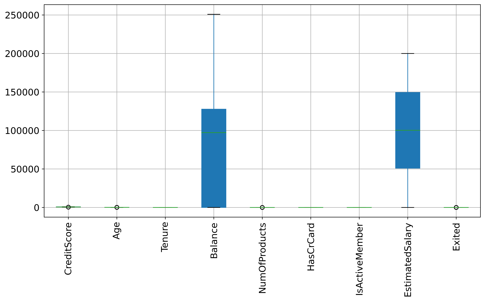
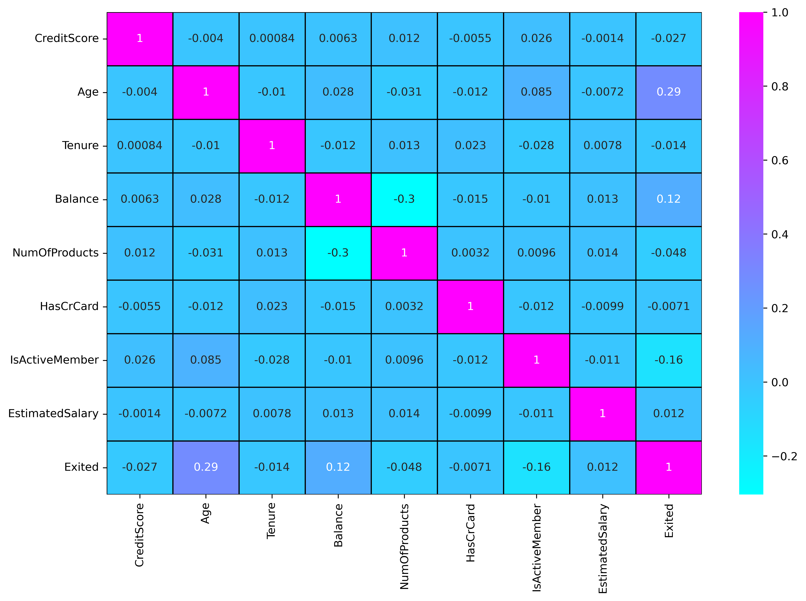
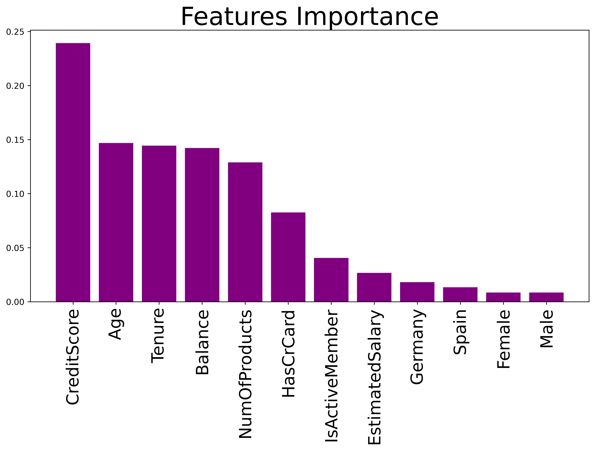

# 🌟 فصل ۷ — آماده‌سازی داده‌ها برای یادگیری ترکیبی

✍️ *نویسنده: سیامک عباس‌نژاد*

---

## 🔹 بخش ۱ — تحلیل اکتشافی داده‌ها (Exploratory Data Analysis)

تحلیل اکتشافی داده‌ها یا همان **EDA**، نخستین گام هوشمندانه در مسیر ساخت مدل‌های یادگیری ماشین است.
در این بخش، هدف ما درک رفتار داده‌ها، شناخت الگوهای پنهان، شناسایی متغیرهای اثرگذار و حذف نقاط پرت است تا پایه‌ای تمیز و قابل اعتماد برای مدل‌سازی ایجاد کنیم.

---

### 🧾 معرفی مجموعه‌داده

مجموعه‌داده‌ی مورد استفاده، **Bank Customer Churn Modeling Dataset** است که شامل اطلاعات **۱۰٬۰۰۰ مشتری بانکی اروپایی** می‌باشد.
هر ردیف، معرف یک مشتری با ویژگی‌های مالی و جمعیت‌شناختی است، از جمله:

| ویژگی             | توضیح                                      |
| ----------------- | ------------------------------------------ |
| `CreditScore`     | امتیاز اعتباری مشتری                       |
| `Geography`       | کشور محل اقامت (فرانسه، آلمان، اسپانیا)    |
| `Gender`          | جنسیت                                      |
| `Age`             | سن مشتری                                   |
| `Tenure`          | سابقه همکاری با بانک                       |
| `Balance`         | موجودی حساب                                |
| `NumOfProducts`   | تعداد محصولات بانکی مورد استفاده           |
| `HasCrCard`       | داشتن کارت اعتباری (۰ یا ۱)                |
| `IsActiveMember`  | فعالیت ماهانه در حساب (۰ یا ۱)             |
| `EstimatedSalary` | حقوق سالیانه‌ی تخمینی                      |
| `Exited`          | متغیر هدف — ترک یا عدم ترک بانک توسط مشتری |

---

## 🎯 هدف از تحلیل داده‌ها

هدف اصلی این مرحله، کسب **درک عمیق از ماهیت داده‌ها** است تا بتوانیم در مراحل بعدی مدل‌سازی، تصمیم‌های دقیق‌تری بگیریم.

به طور خاص، ما می‌خواهیم:

1. وضعیت توزیع مشتریان وفادار و ریزش‌یافته را درک کنیم.
2. رفتار متغیرهای پیوسته مانند سن، امتیاز اعتباری و موجودی را بررسی کنیم.
3. روابط بین ویژگی‌ها را از طریق نقشه‌ی همبستگی (Correlation Map) تحلیل کنیم.
4. و در نهایت، متغیرهای پرت و اثرگذار را شناسایی کنیم.

---

## 🧩 مرحله ۱ — آماده‌سازی و وارد کردن داده‌ها

```python
# Imports
import numpy as np
import pandas as pd
import matplotlib.pyplot as plt
import seaborn as sns

# sklearn / imblearn / xgboost / models
from sklearn.preprocessing import LabelEncoder, StandardScaler
from sklearn.model_selection import train_test_split
from sklearn.ensemble import RandomForestClassifier, GradientBoostingClassifier, VotingClassifier
from sklearn.metrics import accuracy_score, classification_report, confusion_matrix, roc_auc_score, roc_curve

import xgboost as xgb
from imblearn.over_sampling import SMOTEN
```

---

```python
# Reading dataset
customer_data = pd.read_csv(r'D:\Churn_Modelling.csv')

# Dropping irrelevant columns
dataset = customer_data.drop(['RowNumber', 'CustomerId', 'Surname'], axis=1)

# Display dataset dimensions
print(dataset.shape)
```

📘 **توضیح:**
سه ستون غیرتحلیلی حذف شدند، زیرا هیچ ارتباطی با رفتار مشتری ندارند.
اکنون مجموعه‌داده شامل ۱۱ ویژگی کلیدی و ۱۰٬۰۰۰ ردیف معتبر است.

---

## 📊 مرحله ۲ — بررسی توزیع متغیر هدف

```python
# Count churned and non-churned customers
non_churn = dataset[dataset['Exited'] == 0]['Exited'].count()
churn = dataset[dataset['Exited'] == 1]['Exited'].count()

print("non_churn:", non_churn, "\nchurn:", churn)
```

📈 **خروجی:**

```
non_churn: 7963
churn: 2037
```

🔍 **تحلیل:**
تقریباً **۲۰٪ از مشتریان بانک را ترک کرده‌اند**.
این یعنی داده‌ها **نامتوازن (Imbalanced)** هستند و مدل‌ها ممکن است تمایل به پیش‌بینی گروه اکثریت (غیرترک‌کننده‌ها) داشته باشند.
در مراحل بعدی با روش‌هایی مثل **SMOTE** این مشکل برطرف خواهد شد.

---

## 📦 مرحله ۳ — تحلیل ویژگی‌های عددی (Boxplot Analysis)

```python
# Visualizing continuous features distribution
fig, axarr = plt.subplots(3, 2, figsize=(20, 12), dpi=480)

sns.boxplot(y='CreditScore', x='Exited', hue='Exited', data=dataset, ax=axarr[0][0])
sns.boxplot(y='Age', x='Exited', hue='Exited', data=dataset, ax=axarr[0][1])
sns.boxplot(y='Tenure', x='Exited', hue='Exited', data=dataset, ax=axarr[1][0])
sns.boxplot(y='Balance', x='Exited', hue='Exited', data=dataset, ax=axarr[1][1])
sns.boxplot(y='NumOfProducts', x='Exited', hue='Exited', data=dataset, ax=axarr[2][0])
sns.boxplot(y='EstimatedSalary', x='Exited', hue='Exited', data=dataset, ax=axarr[2][1])

plt.xlabel('Exited', fontsize=20, color='black')
plt.ylabel('Feature Value', fontsize=20, color='black')
plt.legend(fontsize="xx-large")
plt.savefig('ContinuousVariables.png')
plt.show()
```


💬 **تحلیل:**
نمودارهای Boxplot نشان می‌دهند که مشتریان **مسن‌تر**، با **موجودی حساب بیشتر** و **اعتبار بالاتر**، احتمال بیشتری برای ترک بانک دارند.
این رفتار می‌تواند ناشی از سطح آگاهی مالی بیشتر یا دسترسی به پیشنهادهای جذاب‌تر از بانک‌های رقیب باشد.

---

## 🚨 مرحله ۴ — شناسایی نقاط پرت (Outliers)

```python
# Detecting outliers across all numerical features
plt.figure(figsize=(12, 6), dpi=480)
dataset.boxplot(patch_artist=True, fontsize=14)
plt.xticks(rotation=90)
plt.title("Detecting Outliers in the Dataset", fontsize=18)
plt.savefig('DetectingOutliers.png')
plt.show()
```


💬 **تحلیل:**
چندین مقدار پرت در ستون‌های `Balance`، `Age` و `CreditScore` مشاهده می‌شود.
این مقادیر در مراحل پیش‌پردازش حذف خواهند شد تا از ایجاد سوگیری در مدل جلوگیری شود.

---

## 🔗 مرحله ۵ — بررسی همبستگی بین ویژگی‌ها

```python
# Correlation heatmap to identify relationships between features
plt.figure(figsize=(12, 8), dpi=480)
sns.heatmap(dataset.corr(), annot=True, cmap="cool", linewidths=1, linecolor='black')
plt.title("Correlation Heatmap", fontsize=22)
plt.savefig('Correlation.png')
plt.show()
```


💬 **تحلیل:**
نقشه‌ی حرارتی نشان می‌دهد ویژگی‌های `Age`، `Balance` و `CreditScore` بیشترین همبستگی را با احتمال ترک مشتری دارند.
این یافته‌ها در طراحی ویژگی‌های جدید (Feature Engineering) بسیار ارزشمند خواهند بود.

---

## ⚙️ مرحله ۶ — کدگذاری و نرمال‌سازی داده‌ها

```python
from sklearn.preprocessing import LabelEncoder, StandardScaler

# Label Encoding for categorical variables
encoder = LabelEncoder()
dataset["Geography"] = encoder.fit_transform(dataset["Geography"])
dataset["Gender"] = encoder.fit_transform(dataset["Gender"])

# One-hot encoding
dataset = dataset.drop(['Geography', 'Gender'], axis=1)
Geography = pd.get_dummies(customer_data.Geography, drop_first=True)
Gender = pd.get_dummies(customer_data.Gender).iloc[:, 0:]

# Merge encoded data
dataset = pd.concat([dataset, Geography, Gender], axis=1)
dataset.shape
```

💬 **تحلیل:**
در این بخش، داده‌های متنی به مقادیر عددی تبدیل شدند تا مدل‌های یادگیری ماشین بتوانند آن‌ها را تحلیل کنند.
این تبدیل گامی ضروری در فرآیند یادگیری ترکیبی است.

---

```python
# Feature scaling
X = dataset.drop(['Exited'], axis=1)
Y = dataset['Exited']

sc = StandardScaler()
X_scaled = sc.fit_transform(X)

X = pd.DataFrame(X_scaled, columns=X.columns)
```

📘 **توضیح:**
مقیاس‌بندی داده‌ها باعث می‌شود متغیرهایی با مقیاس‌های متفاوت (مثل حقوق و سن) وزن برابری در مدل داشته باشند.

---

## 🌲 مرحله ۷ — تحلیل اهمیت ویژگی‌ها (Feature Importance)

```python
from sklearn.ensemble import RandomForestClassifier

# Train a Random Forest to estimate feature importance
features_label = X.columns
forest = RandomForestClassifier(n_estimators=10000, random_state=0, n_jobs=-1)
forest.fit(X, Y)

importances = forest.feature_importances_
indices = np.argsort(importances)[::-1]

# Print feature importance ranking
for i in range(X.shape[1]):
    print("%2d) %-*s %f" % (i + 1, 30, features_label[i], importances[indices[i]]))

# Visualize feature importance
plt.figure(figsize=(12, 6), dpi=480)
plt.title('Feature Importance', fontsize=30)
plt.bar(range(X.shape[1]), importances[indices], color="purple", align="center")
plt.xticks(range(X.shape[1]), features_label, rotation=90, fontsize=20)
plt.savefig('FeaturesImportance.png')
plt.show()
```

📊 **نتیجه:**
ویژگی‌های زیر بیشترین تأثیر را بر پیش‌بینی رفتار مشتری دارند:

| رتبه | ویژگی       | اهمیت نسبی |
| ---- | ----------- | ---------- |
| 1    | CreditScore | 0.239      |
| 2    | Age         | 0.147      |
| 3    | Tenure      | 0.144      |
| 4    | Balance     | 0.142      |



💬 **تحلیل نهایی:**
رفتار مشتری به‌طور مستقیم تحت تأثیر **سن، امتیاز اعتباری و موجودی حساب** قرار دارد.
این یافته، مبنای مرحله‌ی بعدی یعنی **مهندسی ویژگی‌ها و حذف نقاط پرت** خواهد بود.

---

## 🧠 جمع‌بندی بخش ۱ — از مشاهده تا شناخت

در پایان تحلیل اکتشافی داده‌ها دریافتیم که:

* داده‌ها نامتوازن هستند و نیاز به اصلاح دارند.
* روابط مالی و جمعیت‌شناختی بر رفتار مشتری اثرگذارند.
* تعدادی نقاط پرت وجود دارد که باید حذف شوند.
* و در نهایت، ویژگی‌های کلیدی برای مدل شناسایی شدند.

این مرحله نه تنها داده‌ها را برای یادگیری آماده کرد، بلکه مسیر طراحی ویژگی‌ها و انتخاب مدل بهینه را نیز روشن ساخت.

---