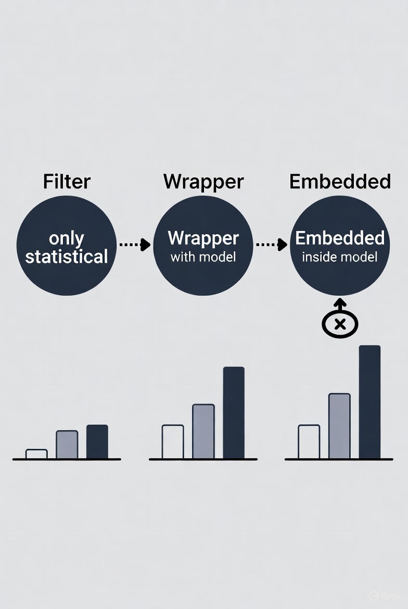

## 🧠 فصل ۳: انتخاب ویژگی‌ها (Feature Selection Methods)

### 📄 صفحه ۳ از ۵ — روش‌های پوششی (Wrapper Methods)

✍️ *نویسنده: سیامک عباس‌نژاد*
🌐 *[https://github.com/pydevcasts](https://github.com/pydevcasts)*

---

### 🔹 مفهوم کلی Wrapper Methods

در این روش‌ها دیگه فقط از آمار استفاده نمی‌کنیم،
بلکه یک مدل یادگیری می‌سازیم (مثلاً Logistic Regression یا Random Forest) و باهاش می‌سنجیم که **هر ترکیب از ویژگی‌ها** چقدر خوب عمل می‌کنه.

به زبان ساده:

> مدل یاد می‌گیره، عملکردش ارزیابی می‌شه، ویژگی‌های ضعیف حذف می‌شن ✂️
> تا فقط بهترین ترکیب باقی بمونه 💎

---

### ⚙️ مزایا و معایب

| مزیت                     | توضیح                                     |
| :----------------------- | :---------------------------------------- |
| ✅ دقت بالا               | چون مستقیماً از عملکرد مدل استفاده می‌کند |
| 🧠 سازگار با هر نوع داده | عددی، متنی، ترکیبی                        |
| ⚠️ هزینه زمانی زیاد      | باید بارها مدل آموزش داده شود             |
| ⚠️ خطر Overfitting       | اگر داده کم باشد                          |

---

### 📊 روش‌های پرکاربرد Wrapper

| نام روش                                    | توضیح                                                   | الگوریتم اصلی   |
| :----------------------------------------- | :------------------------------------------------------ | :-------------- |
| 🔹 **Forward Selection**                   | شروع از ویژگی خالی و اضافه کردن یکی‌یکی بهترین ویژگی‌ها | افزایشی         |
| 🔸 **Backward Elimination**                | شروع از همه‌ی ویژگی‌ها و حذف ضعیف‌ترین ویژگی‌ها         | کاهشی           |
| 🔹 **RFE (Recursive Feature Elimination)** | حذف بازگشتی ویژگی‌ها با کمک مدل یادگیری                 | ترکیبی و خودکار |

---

### 💡 مثال ساده از **Forward Selection**

فرض کن می‌خوای نمره‌ی دانشجو رو پیش‌بینی کنی با ویژگی‌های:
`ساعات مطالعه، ساعت خواب، استفاده از شبکه‌های اجتماعی، حضور در کلاس`

در شروع هیچ ویژگی نداری.
مدل هر بار یک ویژگی اضافه می‌کنه و عملکردش رو می‌سنجه تا بهترین ترکیب پیدا بشه.
در نهایت ممکنه بفهمی دو ویژگی اول برای مدل کافی هستن ✅

---

### 🧮 مثال عملی با **RFE (Recursive Feature Elimination)**

```python
import pandas as pd
from sklearn.feature_selection import RFE
from sklearn.linear_model import LinearRegression

# داده نمونه
data = pd.DataFrame({
    'study_hours': [2, 4, 6, 8, 10, 12],
    'sleep_hours': [9, 8, 7, 6, 5, 4],
    'social_media': [5, 6, 4, 3, 2, 1],
    'attendance': [60, 70, 80, 90, 95, 98],
    'score': [65, 70, 75, 85, 90, 95]
})

X = data[['study_hours', 'sleep_hours', 'social_media', 'attendance']]
y = data['score']

# مدل و RFE
model = LinearRegression()
rfe = RFE(model, n_features_to_select=2)
fit = rfe.fit(X, y)

selected_features = X.columns[fit.support_]
print("Selected Features:", list(selected_features))
```

📈 خروجی:

```
Selected Features: ['study_hours', 'sleep_hours']
```

✅ نتیجه: ساعت مطالعه و ساعت خواب در کلاس مهم‌ترین ویژگی‌ها برای پیش‌بینی نمره هستن 🎯

---

### 🧠 نکته‌ی حرفه‌ای

> اگر زمان و قدرت پردازشی داری، Wrapper روش دقیق‌تری نسبت به Filter هست،
> چون واقعاً با عملکرد مدل تصمیم می‌گیره نه فقط آمار خشک.
> اما برای داده‌های بزرگ، ممکنه خیلی کند باشه ⏳



### 💬 گفت‌وگوی محاوره‌ای کوتاه

👩‍💻 دانشجو: استاد! اگه ۵۰۰ ویژگی داشته باشم و بخوام با Wrapper کار کنم، چی می‌شه؟
👨‍🏫 استاد: احتمالاً لپ‌تاپت داغ می‌کنه 😄
پس بهتره اول با Filter یه پیش‌انتخاب انجام بدی، بعد Wrapper!

---

### 🧩 تمرین

با داده‌ی ساختگی شامل سه ویژگی (`study_hours`, `sleep_hours`, `attendance`)
و متغیر هدف (`score`)، یک مدل LinearRegression بساز و با RFE دو ویژگی برتر را انتخاب کن.

---

### ❓ پرسش چهارگزینه‌ای

در روش Wrapper چه چیزی مبنای انتخاب ویژگی‌هاست؟

A) میانگین مقادیر ویژگی‌ها

B) عملکرد مدل یادگیری ✅

C) مقادیر گمشده

D) نوع داده‌ها

