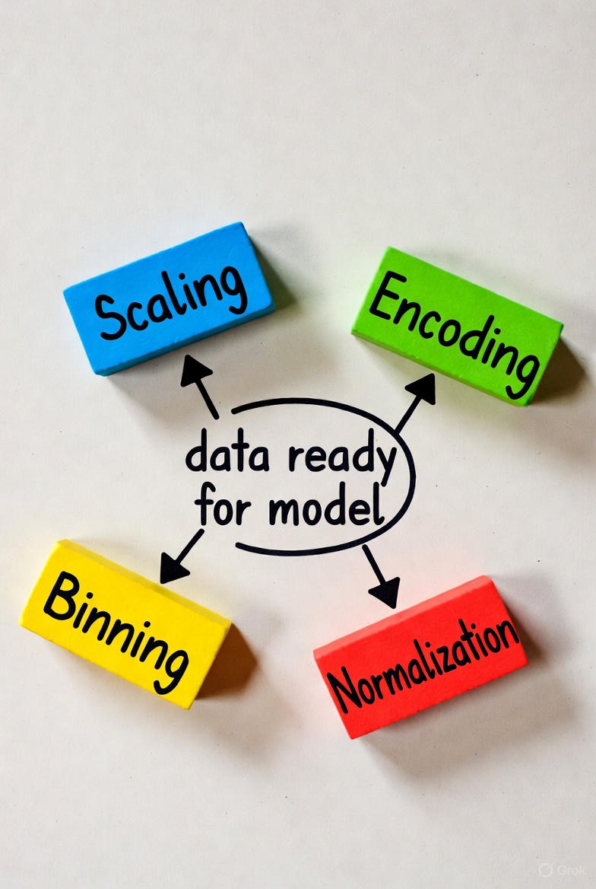

## 🧠 فصل ۴: ساخت و تبدیل ویژگی‌ها (Feature Construction & Transformation)

### 📄 صفحه ۴ از ۵ — تبدیل ویژگی‌ها (Scaling, Encoding, Binning, Normalization)

✍️ *نویسنده: سیامک عباس‌نژاد*
🌐 *[https://github.com/pydevcasts](https://github.com/pydevcasts)*

---

### 🎯 هدف این صفحه

در این بخش یاد می‌گیری چطور داده‌هاتو به‌شکلی مناسب برای مدل آماده کنی.
مدل‌های یادگیری ماشین مثل انسان‌ها نیستن؛
اون‌ها **بزرگی عدد، نوع داده، یا ترتیب مقادیر** رو مثل ما نمی‌فهمن 😅
پس باید داده‌ها رو طوری آماده کنیم که مدل درست متوجه معناشون بشه.

---

### ⚙️ انواع تبدیل ویژگی‌ها

| نوع تبدیل                         | کاربرد                              | مثال                            |
| :-------------------------------- | :---------------------------------- | :------------------------------ |
| 📏 **Scaling (مقیاس‌بندی)**       | هم‌سطح کردن ویژگی‌ها                | سن = ۲۰ تا ۶۰ → تبدیل به ۰ تا ۱ |
| 🧩 **Encoding (کدگذاری)**         | تبدیل داده‌های متنی به عددی         | شهر = [تهران، تبریز] → [0,1]    |
| 📊 **Binning (بازه‌بندی)**        | تبدیل مقدار پیوسته به بازه‌ها       | سن = ۲۳ → گروه سنی = جوان       |
| ⚖️ **Normalization (نرمال‌سازی)** | قرار دادن ویژگی‌ها در محدوده‌ی مشخص | از -1 تا 1 یا 0 تا 1            |

---

### 💡 ۱. مقیاس‌بندی (Scaling)

بعضی مدل‌ها مثل KNN یا SVM به مقیاس عددها حساس هستن.
برای همین باید همه ویژگی‌ها رو هم‌سطح کنیم.

#### 🔹 Min-Max Scaling

فرمول:
$$
X_{scaled} = \frac{X - X_{min}}{X_{max} - X_{min}}
$$

```python
from sklearn.preprocessing import MinMaxScaler
import pandas as pd

data = pd.DataFrame({'age': [20, 40, 60], 'income': [3000, 7000, 15000]})
scaler = MinMaxScaler()
scaled = scaler.fit_transform(data)
pd.DataFrame(scaled, columns=data.columns)
```

📊 خروجی:

| age | income |
| :-: | :----: |
| 0.0 |   0.0  |
| 0.5 |  0.33  |
| 1.0 |   1.0  |

💡 حالا همه‌ی مقادیر در بازه‌ی ۰ تا ۱ قرار دارن.

---

### 💡 ۲. نرمال‌سازی (Normalization)

در نرمال‌سازی، داده‌ها طوری تنظیم می‌شن که بردار هر سطر طول یکسانی داشته باشه (مثلاً برای داده‌های متنی یا برداری).

```python
from sklearn.preprocessing import Normalizer

norm = Normalizer()
normalized = norm.fit_transform(data)
pd.DataFrame(normalized, columns=data.columns)
```

📘 کاربرد ویژه در داده‌هایی مثل TF-IDF و مدل‌های مبتنی بر فاصله.

---

### 💡 ۳. کدگذاری (Encoding)

مدل‌های ماشین نمی‌تونن مستقیم داده‌های متنی رو درک کنن.
پس باید اون‌ها رو به عدد تبدیل کنیم ✨

#### 🔹 One-Hot Encoding

```python
from sklearn.preprocessing import OneHotEncoder

cities = pd.DataFrame({'city': ['Tehran', 'Tabriz', 'Tehran', 'Shiraz']})
enc = OneHotEncoder(sparse_output=False)
encoded = enc.fit_transform(cities)
pd.DataFrame(encoded, columns=enc.get_feature_names_out(['city']))
```

📊 خروجی:

| city_Shiraz | city_Tabriz | city_Tehran |
| :---------: | :---------: | :---------: |
|      0      |      0      |      1      |
|      0      |      1      |      0      |
|      0      |      0      |      1      |
|      1      |      0      |      0      |

💡 هر شهر به یک بردار باینری تبدیل شد.

---

### 💡 ۴. بازه‌بندی (Binning)

بازه‌بندی یعنی تبدیل داده‌های پیوسته به گروه‌های طبقه‌بندی شده.
برای مثال، سن از عدد تبدیل به دسته می‌شه: نوجوان، جوان، میان‌سال و سالمند.

```python
import pandas as pd
bins = [0, 18, 35, 50, 100]
labels = ['Teen', 'Young', 'Mid', 'Old']

data = pd.DataFrame({'age': [15, 22, 37, 55, 80]})
data['age_group'] = pd.cut(data['age'], bins=bins, labels=labels)
print(data)
```

📊 خروجی:

| age | age_group |
| :-: | :-------: |
|  15 |    Teen   |
|  22 |   Young   |
|  37 |    Mid    |
|  55 |    Old    |
|  80 |    Old    |

💡 این تبدیل برای درک مدل از رفتار گروهی داده‌ها عالیه.

---


---

### 💬 گفت‌وگوی استاد و دانشجو

👩‍💻 استاد، اگه داده‌هام هم عددی باشن و هم متنی چی؟
👨‍🏫 اون وقت باید از ترکیب چند تبدیل استفاده کنی! مثلاً OneHot برای متن و Scaling برای عدد.
👩‍💻 یعنی می‌تونم توی Pipeline بذارمشون؟
👨‍🏫 آفرین، دقیقاً همین‌طوره! 👏

---

### 🧩 تمرین

داده‌ای شامل ستون‌های `age`, `income`, `city` بساز.
🔹 سن را با Binning به بازه‌های سنی تقسیم کن.
🔹 شهر را با OneHotEncoder کدگذاری کن.
🔹 درآمد را با MinMaxScaler مقیاس‌بندی کن.

سپس بررسی کن آیا همه‌ی داده‌ها آماده‌ی استفاده در مدل هستند یا خیر؟

---

### ❓ پرسش چهارگزینه‌ای

کدام روش برای تبدیل داده‌ی متنی به عددی استفاده می‌شود؟

A) Scaling

B) Normalization

C) One-Hot Encoding ✅

D) Binning

