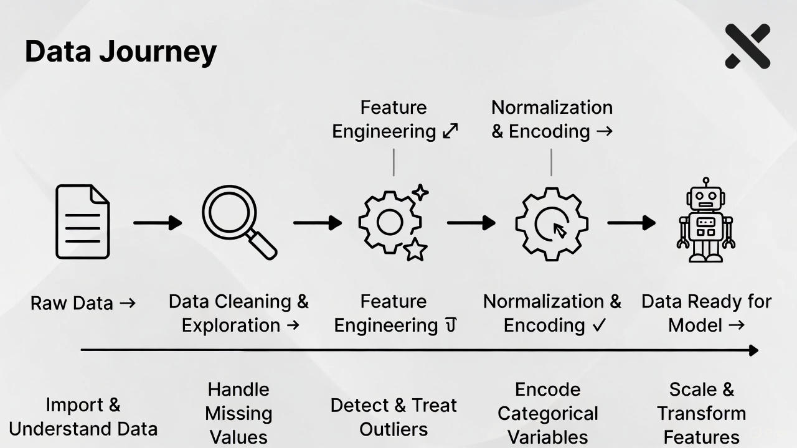

## 🧠 فصل ۴: ساخت و تبدیل ویژگی‌ها (Feature Construction & Transformation)

### 📄 صفحه ۵ از ۵ — جمع‌بندی، مثال جامع و تمرین عملی

✍️ *نویسنده: سیامک عباس‌نژاد*
🌐 *[https://github.com/pydevcasts](https://github.com/pydevcasts)*

---

### 🎯 هدف این صفحه

در این صفحه می‌خوایم تمام مفاهیم قبلی — از **ویژگی‌های جدید، تعامل، نرمال‌سازی و کدگذاری** — رو در یک مثال واقعی ترکیب کنیم.
هدف: آمادگی برای استفاده‌ی حرفه‌ای از Feature Engineering در پروژه‌های واقعی 💪

---

### 💼 مثال جامع: پیش‌بینی قیمت خانه

فرض کن دیتاستی داری با ستون‌های زیر:

* `area` (مساحت خانه به متر مربع)
* `rooms` (تعداد اتاق‌ها)
* `age` (عمر ساختمان)
* `city` (شهر)
* `price` (قیمت هدف)

می‌خوای با مهندسی ویژگی‌ها داده‌هات رو برای مدل آماده کنی.

---

### 🔹 گام ۱: ساخت ویژگی جدید

با ترکیب چند ویژگی، شاخص‌های جدید می‌سازیم که معنی بیشتری دارن:

```python
import pandas as pd

data = pd.DataFrame({
    'area': [80, 120, 60, 200],
    'rooms': [3, 4, 2, 6],
    'age': [10, 5, 20, 2],
    'city': ['Tehran', 'Tabriz', 'Shiraz', 'Tehran'],
    'price': [4.5, 5.8, 3.2, 9.0]
})

# شاخص تراکم (هر متر چند اتاق)
data['density'] = data['rooms'] / data['area']

# تعامل بین مساحت و سن ساختمان
data['area_age_interaction'] = data['area'] * data['age']
```

---

### 🔹 گام ۲: نرمال‌سازی و مقیاس‌بندی

چون `area` و `age` در مقیاس‌های مختلف هستن، اون‌ها رو هم‌سطح می‌کنیم:

```python
from sklearn.preprocessing import MinMaxScaler

scaler = MinMaxScaler()
scaled = scaler.fit_transform(data[['area', 'age', 'density', 'area_age_interaction']])
scaled_df = pd.DataFrame(scaled, columns=['area', 'age', 'density', 'area_age_interaction'])
```

---

### 🔹 گام ۳: کدگذاری ویژگی متنی

ویژگی `city` متنیه، پس باید عددی بشه تا مدل بفهمتش 👇

```python
from sklearn.preprocessing import OneHotEncoder

encoder = OneHotEncoder(sparse_output=False)
encoded = encoder.fit_transform(data[['city']])
encoded_df = pd.DataFrame(encoded, columns=encoder.get_feature_names_out(['city']))
```

---

### 🔹 گام ۴: ترکیب همه‌ی داده‌ها

```python
final_data = pd.concat([scaled_df, encoded_df, data[['price']]], axis=1)
print(final_data)
```

📊 خروجی نهایی:

|  area |  age  | density | area_age_interaction | city_Shiraz | city_Tabriz | city_Tehran | price |
| :---: | :---: | :-----: | :------------------: | :---------: | :---------: | :---------: | :---: |
| 0.125 | 0.421 |   0.35  |         0.47         |      0      |      0      |      1      |  4.5  |
| 0.375 |  0.21 |   0.26  |         0.12         |      0      |      1      |      0      |  5.8  |
|  0.0  |  0.84 |   0.33  |         1.00         |      1      |      0      |      0      |  3.2  |
|  1.0  |  0.0  |   0.25  |         0.00         |      0      |      0      |      1      |  9.0  |

🧠 حالا داده‌ی آماده برای آموزش مدل مثل `LinearRegression` یا `XGBoost` داریم!

---



---

### 💬 گفت‌وگوی استاد و دانشجو

👩‍💻 استاد، یعنی هر بار باید دستی این تبدیل‌ها رو انجام بدم؟
👨‍🏫 نه دقیقاً! می‌تونی از `Pipeline` در scikit-learn استفاده کنی تا کل فرآیند اتوماتیک بشه 😎
👩‍💻 و اگه بعداً داده‌ی جدید اضافه بشه؟
👨‍🏫 فقط `fit_transform` رو برای داده‌ی جدید اجرا کن، بقیه‌ی مراحل خودش انجام می‌شه.

---

### 📘 نکات طلایی برای مهندسی ویژگی‌ها

✅ هر ویژگی جدید باید **منطقی** باشه (نه صرفاً زیاد!).
✅ همبستگی بالا بین ویژگی‌ها می‌تونه مدل رو گیج کنه.
✅ همیشه بعد از ساخت ویژگی، با تحلیل آماری یا بصری بررسی کن که واقعاً مفید هست یا نه.
✅ مهندسی ویژگی‌ها بیشتر **هنر داده‌کاوی** هست تا صرفاً تکنیک 💡

---

### 🧩 تمرین عملی

۱️⃣ دیتاست فرضی فروش خودرو بساز با ستون‌های `year`, `mileage`, `engine`, `price`.
۲️⃣ ویژگی جدید بساز: `engine_per_year = engine / (2025 - year)`
۳️⃣ سپس ویژگی‌ها رو مقیاس‌بندی و نرمال‌سازی کن.
۴️⃣ خروجی رو چاپ کن و بررسی کن کدام ویژگی بیشترین همبستگی را با `price` دارد؟

---

### ❓ پرسش چهارگزینه‌ای

کدام مورد از اهداف اصلی مهندسی ویژگی‌ها نیست؟
A) افزایش دقت مدل
B) آماده‌سازی داده برای یادگیری بهتر
C) حذف تصادفی داده‌ها ✅
D) کشف روابط پنهان بین متغیرها

