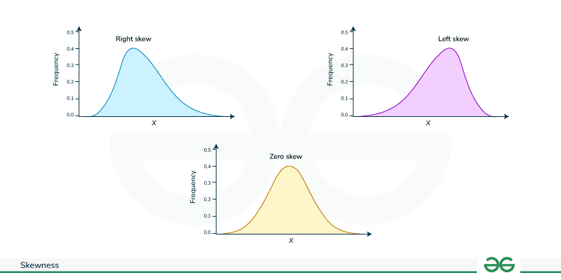

## 📘 آموزش ساده چولگی (Skewness)، تبدیل لگاریتمی (Log Transform) و Winsorization در پایتون

### 🎯 مقدمه
در علم داده، داده‌ها همیشه تمیز و متعادل نیستند. گاهی برخی مقادیر خیلی بزرگ یا خیلی کوچک می‌شوند و باعث می‌شوند مدل‌های یادگیری ماشین عملکرد ضعیفی داشته باشند.  
برای حل این مشکل معمولاً از چند تکنیک پیش‌پردازش استفاده می‌کنیم:  
1) بررسی چولگی (Skewness)  
2) تبدیل لگاریتمی (Log Transform)  
3) از Winsorization برای کنترل اثر Outlierها  

---

## 📌 چولگی (Skewness) چیست؟
چولگی نشان می‌دهد توزیع داده‌ها چقدر از حالت متقارن فاصله دارد.

- اگر **Skewness نزدیک 0** باشد: داده‌ها تقریباً متقارن هستند.
- اگر **Skewness مثبت** باشد: چند مقدار **خیلی بزرگ** باعث کشیده شدن توزیع به سمت راست شده‌اند.
- اگر **Skewness منفی** باشد: چند مقدار **خیلی کوچک** باعث کشیده شدن توزیع به سمت چپ شده‌اند.



در بسیاری از موارد، اگر:

$$[
|Skewness| > 2
]$$
به عنوان **چولگی زیاد** در نظر گرفته می‌شود و بهتر است آن ستون اصلاح شود.

---

## 📌 تبدیل لگاریتمی (Log Transform)
اگر ستونی چولگی زیادی داشته باشد، یکی از روش‌های رایج این است که از تبدیل لگاریتمی استفاده کنیم تا مقادیر خیلی بزرگ “فشرده” شوند.

رایج‌ترین تابع:
```python
np.log1p(x)
```

این تابع یعنی:
\[
log(1 + x)
\]
مزیت مهم `log1p` این است که حتی اگر **x=0** باشد هم مقدار قابل محاسبه تولید می‌کند.

### مثال ساده
فرض کنید:
```python
salary = [10, 12, 15, 18, 20, 500]
```
عدد **500** خیلی بزرگ‌تر از بقیه است. حال تبدیل:
```python
import numpy as np

salary = [10, 12, 15, 18, 20, 500]
print(np.log1p(salary))
```

بعد از تبدیل لگاریتمی، فاصله بین مقدار 500 و بقیه کمتر می‌شود و توزیع متعادل‌تر می‌شود.

---

## 📌 مفهوم Winsorization 
خوب Winsorization برای زمانی است که نمی‌خواهیم داده‌های پرت (Outlier) را حذف کنیم، بلکه فقط می‌خواهیم اثرشان کمتر شود.

در Winsorization:
- مقادیر خیلی بزرگ یا خیلی کوچک با **نزدیک‌ترین مقدار قابل قبول** جایگزین می‌شوند.
- تعداد داده‌ها تغییر نمی‌کند؛ فقط مقدارهای افراطی “کاهش اثر” پیدا می‌کنند.

مثلاً اگر محدودیت را **1% و 99%** (یعنی 1% بالا و 1% پایین) بگذاریم:
- پایین‌ترین 1% مقدارها محدود می‌شوند
- بالاترین 1% مقدارها هم محدود می‌شوند

### مثال ساده Winsorization
```python

from scipy.stats.mstats import winsorize

numbers = [1,2,3,4,5,6,7,8,9,100]
numbers = np.array(numbers)

new_numbers = winsorize(numbers, limits=(0.1, 0.1))
print(new_numbers)
```

در این مثال مقدار 100 که پرت است، با مقدار کنترل‌شده‌تر جایگزین می‌شود.

---

## 📌 محاسبه چولگی (Skewness)
برای محاسبه skewness:
```python
from scipy.stats import skew

numbers = [1,2,3,4,5,100]
print(skew(numbers))
```

اگر خروجی بزرگ (مثبت یا منفی) باشد، یعنی داده‌ها چولگی دارند.

---

## 📌 مثال کامل و ساده
```python
import numpy as np
from scipy.stats import skew
from scipy.stats.mstats import winsorize

data = [2, 3, 4, 5, 6, 7, 8, 9, 10, 100]

# Calculate skewness
print("Skewness:", skew(data))

# Log transform
log_data = np.log1p(data)
print("Log Transform:", log_data)

# Winsorization to limit the effect of outliers
win_data = winsorize(np.array(data), limits=(0.1, 0.1))
print("Winsorization:", win_data)
```

---

## 📌 چه زمانی از هر روش استفاده کنیم؟
- اگر **Skewness زیاد** باشد → معمولاً از **Log Transform** استفاده می‌کنیم.
- اگر تعداد **Outlierها کم** باشد یا فقط بخواهیم اثرشان کمتر شود → از **Winsorization** استفاده می‌کنیم.
- در بسیاری از پروژه‌ها روند پیشنهادی این است:
  1) ابتدا skewness بررسی شود  
  2) اگر زیاد بود، log transform انجام شود  
  3) سپس روی بقیه ستون‌ها برای کاهش اثر outlier، winsorization اعمال شود  

---

## ✅ جمع‌بندی
- با **Skewness** نشان می‌دهیم توزیع داده نامتقارن است یا نه.  
- اگر چولگی زیاد باشد، **Log Transform** کمک می‌کند مقادیر بزرگ کمتر اثر مخرب داشته باشند.  
- اگر نخواهیم داده پرت حذف شود، **Winsorization** اثر outlier را با محدود کردن آن کنترل می‌کند.  
این مراحل معمولاً باعث بهبود عملکرد مدل‌های یادگیری ماشین می‌شوند.
