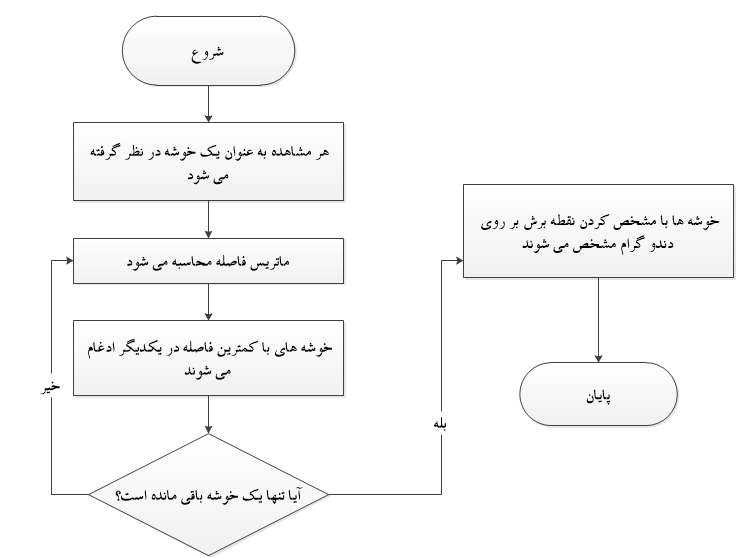
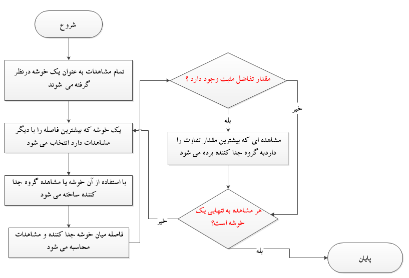

**کتاب خوشه‌بندی سلسله‌مراتبی (Hierarchical Clustering)**

📘 **فصل ۱: مقدمه**

یادگیری ماشین به دو شاخهٔ اصلی تقسیم می‌شود:
1. **یادگیری با ناظر (Supervised Learning)**: در این روش، داده‌ها به همراه برچسب‌های واقعی در اختیار مدل قرار می‌گیرند.
2. **یادگیری بدون ناظر (Unsupervised Learning)**: در این حالت، داده‌ها بدون برچسب به مدل داده می‌شوند.

در میان روش‌های یادگیری بدون ناظر، یکی از مهم‌ترین وظایف **خوشه‌بندی (Clustering)** است؛ که به معنای شناسایی گروه‌هایی از داده‌هاست که شباهت‌های زیادی با یکدیگر دارند.

### 🎯 خوشه‌بندی چیست؟
فرض کنید مجموعه‌ای از داده‌ها داریم، اما هیچ برچسبی برای آن‌ها وجود ندارد. در این حالت، الگوریتم خوشه‌بندی تلاش می‌کند داده‌ها را به دسته‌هایی (خوشه‌ها) تقسیم کند که درون هر خوشه، داده‌ها همگن‌تر و نسبت به خوشه‌های دیگر متمایز باشند.

به عنوان مثال:
- در **بازاریابی** می‌توان مشتریان را بر اساس رفتار خرید خوشه‌بندی کرد.
- در **زیست‌شناسی** می‌توان ژن‌ها یا گونه‌ها را بر اساس ویژگی‌های مشترک در یک خوشه قرار داد.
- در **پردازش متن** می‌توان مقالات یا ایمیل‌ها را به خوشه‌هایی با موضوعات مشابه دسته‌بندی کرد.

### 🔹 تفاوت خوشه‌بندی سلسله‌مراتبی با K-Means
الگوریتم‌هایی مانند **K-Means** نیاز دارند که تعداد خوشه‌ها از قبل مشخص شود. اما در بسیاری از مسائل واقعی، ما از تعداد خوشه‌ها آگاهی نداریم. در اینجا، خوشه‌بندی سلسله‌مراتبی به کار می‌آید.

**ویژگی‌های خوشه‌بندی سلسله‌مراتبی:**
- نیازی به تعیین تعداد خوشه‌ها در ابتدا ندارد.
- ساختاری شبیه به یک درخت (Tree) ایجاد می‌کند که به آن **دندروگرام (Dendrogram)** می‌گویند.
- از روی دندروگرام می‌توان تصمیم گرفت که داده‌ها در چند خوشه تقسیم شوند.

### 🔹 دو رویکرد اصلی در خوشه‌بندی سلسله‌مراتبی
1. **روش پایین به بالا (Agglomerative)**:
   - در این روش، هر داده ابتدا به عنوان یک خوشهٔ مستقل در نظر گرفته می‌شود.
   - در هر مرحله، دو خوشه‌ای که بیشترین شباهت را دارند با هم ادغام می‌شوند.
   - این روند ادامه می‌یابد تا همه داده‌ها در یک خوشهٔ بزرگ قرار گیرند.

2. **روش بالا به پایین (Divisive)**:
   - در این روش، همه داده‌ها ابتدا در یک خوشهٔ بزرگ قرار می‌گیرند.
   - سپس خوشه‌ها به تدریج شکسته می‌شوند تا خوشه‌های کوچک‌تر ایجاد شوند.

📌 در عمل، روش **Agglomerative** بسیار پرکاربردتر است و اغلب به همین روش اشاره می‌شود.

### 🔹 چرا دندروگرام مهم است؟
**دندروگرام** یک نمودار درختی است که نشان می‌دهد داده‌ها چگونه به هم متصل شده‌اند یا از هم جدا شده‌اند. با مشاهده دندروگرام:
- می‌توان فهمید که داده‌ها چه ساختار سلسله‌مراتبی دارند.
- می‌توان تعداد خوشه مناسب را انتخاب کرد (با برش زدن درخت در ارتفاع مشخص).

✅ در این فصل با مفاهیم کلی خوشه‌بندی سلسله‌مراتبی آشنا شدیم. از فصل بعد به سراغ مفاهیم ریاضی و انواع فاصله‌ها و معیارهای شباهت خواهیم رفت.
