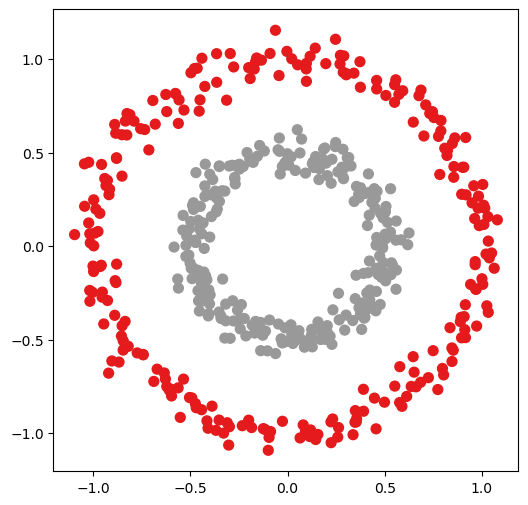
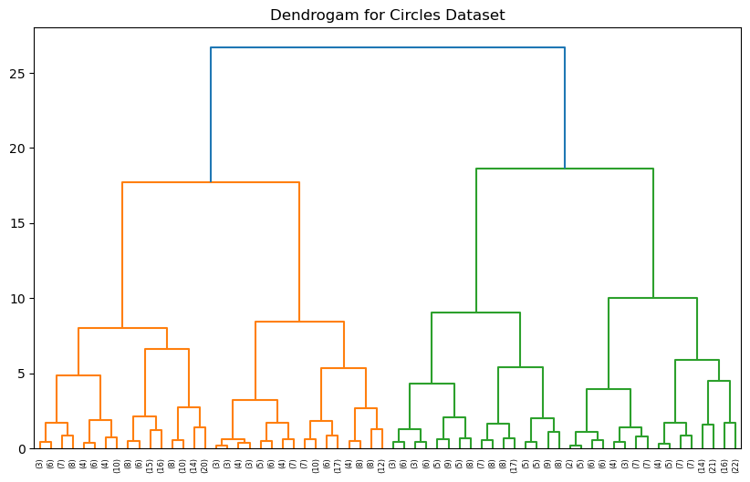
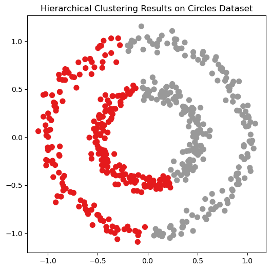

**کتاب خوشه‌بندی سلسله‌مراتبی (Hierarchical Clustering)**  
**نویسنده: سیامک عباس‌نژاد**

---

📘 **فصل ۶: خوشه‌بندی سلسله‌مراتبی روی داده‌های مصنوعی**

برای اینکه قدرت و ضعف الگوریتم خوشه‌بندی سلسله‌مراتبی را بهتر درک کنیم، این بار به جای دیتاست واقعی مثل **Iris**، از داده‌های مصنوعی استفاده می‌کنیم.

### 🔹 مرحله ۱: تولید داده مصنوعی (Circles)
```python
from sklearn.datasets import make_circles

# Generate synthetic dataset
X_circles, y_circles = make_circles(n_samples=500, factor=0.5, noise=0.05, random_state=42)

# Visualize dataset
plt.figure(figsize=(6,6))
plt.scatter(X_circles[:,0], X_circles[:,1], c=y_circles, cmap="viridis", s=50)
plt.title("Synthetic Circles Dataset")
plt.show()
```


📌 **نتیجه**: همانطور که می‌بینیم، داده‌ها به صورت دو دایره تو در تو تولید شده‌اند. این نوع داده‌ها برای بررسی توانایی الگوریتم‌ها در تشخیص ساختارهای غیرخطی بسیار مناسب هستند.

### 🔹 مرحله ۲: اجرای خوشه‌بندی سلسله‌مراتبی
```python
# Standardize features
X_circles_scaled = StandardScaler().fit_transform(X_circles)

# Apply hierarchical clustering
Z_circles = linkage(X_circles_scaled, method="ward")

# Plot dendrogram
plt.figure(figsize=(12,6))
dendrogram(Z_circles, truncate_mode="level", p=5)
plt.title("Dendrogram for Circles Dataset")
plt.show()
```


📌 **نتیجه**: دندروگرام نشان می‌دهد که الگوریتم چگونه داده‌ها را در سطوح مختلف ادغام کرده است.

### 🔹 مرحله ۳: تشکیل خوشه‌ها
```python
# Form 2 clusters
clusters_circles = fcluster(Z_circles, t=2, criterion="maxclust")

# Plot results
plt.figure(figsize=(6,6))
plt.scatter(X_circles[:,0], X_circles[:,1], c=clusters_circles, cmap="Set1", s=50)
plt.title("Hierarchical Clustering Results on Circles Dataset")
plt.show()
```


📌 **نتیجه**: همانطور که مشاهده می‌کنیم، خوشه‌بندی سلسله‌مراتبی توانست تا حدی دو خوشه را تشکیل دهد، اما شکل واقعی دایره‌ها به خوبی شناسایی نشده است.

### 🔹 مرحله ۴: مقایسه با برچسب‌های واقعی
```python
from sklearn.metrics import adjusted_rand_score, silhouette_score

# Calculate ARI and Silhouette Score
ari_circles = adjusted_rand_score(y_circles, clusters_circles)
sil_score_circles = silhouette_score(X_circles_scaled, clusters_circles)

print("ARI (Adjusted Rand Index):", ari_circles)
print("Silhouette Score:", sil_score_circles)
```
📌 **نتیجه**: نتایج عددی معمولاً ضعیف‌تر از دیتاست **Iris** خواهند بود، چون خوشه‌بندی سلسله‌مراتبی برای داده‌های غیرخطی مثل دایره‌ها مناسب نیست.

### 🔹 جمع‌بندی
خوشه‌بندی سلسله‌مراتبی برای داده‌های خطی و با جدایی ساده مثل **Iris** بسیار خوب عمل می‌کند.  
در داده‌های غیرخطی (مثل **Circles**) الگوریتم ناتوان است و خوشه‌ها را اشتباه تشخیص می‌دهد.  
برای چنین داده‌هایی باید از الگوریتم‌های دیگر مثل **DBSCAN** یا **Spectral Clustering** استفاده کرد.

✅ در این فصل دیدیم که خوشه‌بندی سلسله‌مراتبی همیشه بهترین گزینه نیست و در داده‌های پیچیده محدودیت دارد.
