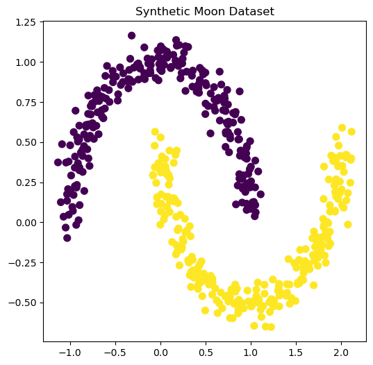

**کتاب خوشه‌بندی سلسله‌مراتبی (Hierarchical Clustering)**  
**نویسنده: سیامک عباس‌نژاد**

---

📘 **فصل ۷: خوشه‌بندی سلسله‌مراتبی روی داده‌های Moons**

در این فصل یکی دیگر از دیتاست‌های مصنوعی پرکاربرد به نام **Moons** را بررسی می‌کنیم. این داده‌ها دو شکل نیم‌دایره‌ای دارند که برای بررسی توانایی الگوریتم‌ها در تشخیص ساختارهای غیرخطی بسیار جالب است.

### 🔹 مرحله ۱: تولید داده Moons
```python
from sklearn.datasets import make_moons

# Generate synthetic dataset
X_moons, y_moons = make_moons(n_samples=500, noise=0.07, random_state=42)

# Visualize dataset
plt.figure(figsize=(6,6))
plt.scatter(X_moons[:,0], X_moons[:,1], c=y_moons, cmap="viridis", s=50)
plt.title("Synthetic Moons Dataset")
plt.show()
```


📌 **نتیجه**: همانطور که می‌بینیم، داده‌ها به شکل دو نیم‌دایره هستند که از هم جدا شده‌اند.

### 🔹 مرحله ۲: اجرای خوشه‌بندی سلسله‌مراتبی
```python
# Standardize features
X_moons_scaled = StandardScaler().fit_transform(X_moons)

# Apply hierarchical clustering
Z_moons = linkage(X_moons_scaled, method="ward")

# Plot dendrogram
plt.figure(figsize=(12,6))
dendrogram(Z_moons, truncate_mode="level", p=5)
plt.title("Dendrogram for Moons Dataset")
plt.show()
```
📌 **نتیجه**: دندروگرام نشان می‌دهد که داده‌ها در چندین مرحله ادغام شده‌اند، اما مرز دقیق خوشه‌ها همچنان مبهم است.

### 🔹 مرحله ۳: تشکیل خوشه‌ها
```python
# Form 2 clusters
clusters_moons = fcluster(Z_moons, t=2, criterion="maxclust")

# Plot results
plt.figure(figsize=(6,6))
plt.scatter(X_moons[:,0], X_moons[:,1], c=clusters_moons, cmap="Set1", s=50)
plt.title("Hierarchical Clustering Results on Moons Dataset")
plt.show()
```
📌 **نتیجه**: الگوریتم خوشه‌بندی سلسله‌مراتبی خوشه‌ها را اشتباه تقسیم می‌کند و برخی نقاط دو نیم‌دایره در یک خوشه قرار گرفته‌اند.

### 🔹 مرحله ۴: ارزیابی نتایج
```python
from sklearn.metrics import adjusted_rand_score, silhouette_score

# Evaluate results
ari_moons = adjusted_rand_score(y_moons, clusters_moons)
sil_score_moons = silhouette_score(X_moons_scaled, clusters_moons)

print("ARI (Adjusted Rand Index):", ari_moons)
print("Silhouette Score:", sil_score_moons)
```
📌 **نتیجه**: همانطور که انتظار داشتیم، شاخص‌های **ARI** و **Silhouette** پایین هستند و نشان می‌دهند که خوشه‌بندی سلسله‌مراتبی در این داده‌ها عملکرد ضعیفی دارد.

### 🔹 جمع‌بندی
خوشه‌بندی سلسله‌مراتبی برای داده‌های ساده و خطی مثل **Iris** مناسب است.  
در داده‌های غیرخطی مثل **Moons** و **Circles** این الگوریتم ضعف جدی دارد.  
برای چنین داده‌هایی باید به سراغ الگوریتم‌های پیشرفته‌تر مثل **DBSCAN** یا **Spectral Clustering** برویم.

✅ در این فصل دیدیم که خوشه‌بندی سلسله‌مراتبی محدودیت‌هایی دارد و همیشه بهترین انتخاب نیست.
