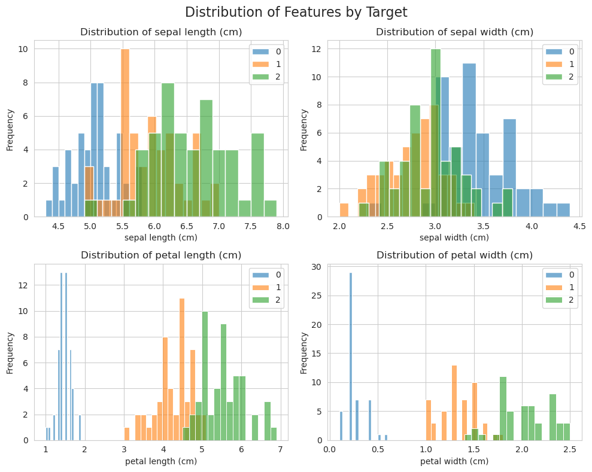
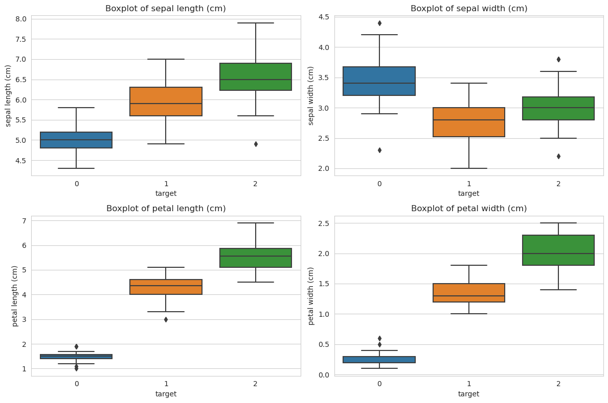
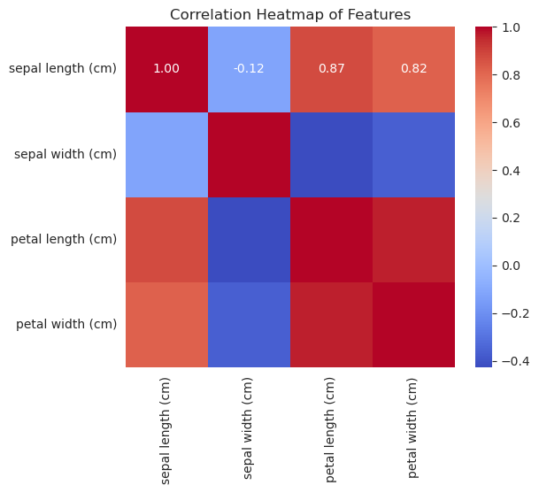
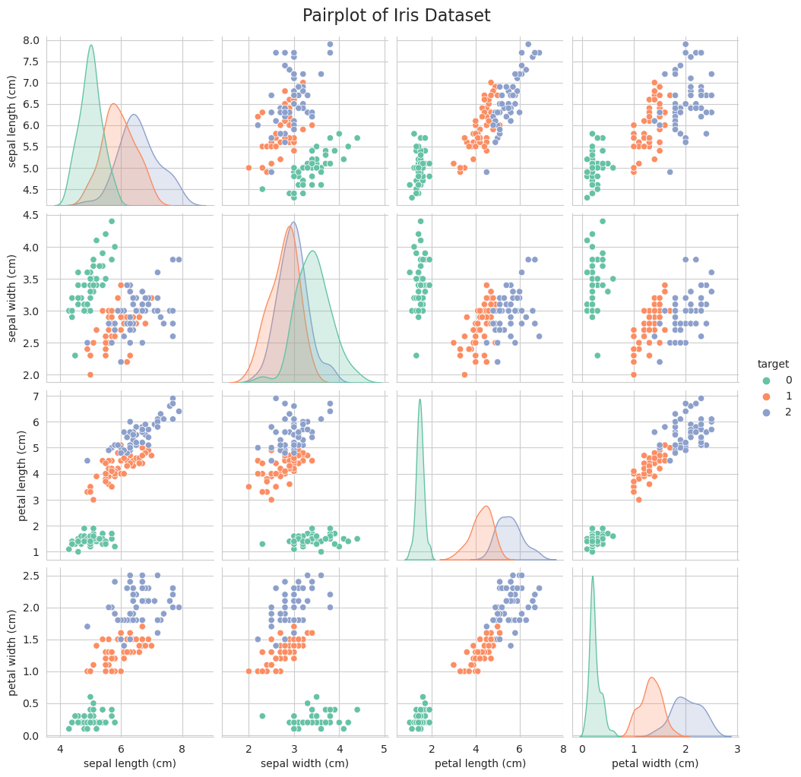

# 📖 فصل چهارم: پیاده‌سازی K-Means روی دیتاست Iris

---

## 🔹 مرحله اول: بارگذاری دیتاست Iris

ابتدا دیتاست رو از **scikit-learn** بارگذاری می‌کنیم و یه نگاه اولیه بهش می‌ندازیم.

```python
# Import libraries
import pandas as pd
import seaborn as sns
import matplotlib.pyplot as plt
from sklearn.datasets import load_iris

# Load Iris dataset
iris = load_iris()

# Create DataFrame
df = pd.DataFrame(iris.data, columns=iris.feature_names)
df['target'] = iris.target

# Show first rows
print(df.head())

# Show dataset info
print(df.info())
```

---

## 🔹 مرحله دوم: تحلیل داده‌ها (EDA)

اینجا با استفاده از نمودارها توزیع ویژگی‌ها و روابط بین آن‌ها رو بررسی می‌کنیم.

### ۱. توزیع هر ویژگی (Histogram)

```python
import seaborn as sns
import matplotlib.pyplot as plt

# Assume df has a 'target' column as well
sns.set_style("whitegrid")
plt.figure(figsize=(10, 8))

# List of features (excluding the 'target' column)
features = df.columns[:-1]  # or df.iloc[:, :-1].columns

for i, feature in enumerate(features):
    plt.subplot(2, 2, i + 1)
    for target_class in df['target'].unique():
        subset = df[df['target'] == target_class]
        sns.histplot(subset[feature], bins=15, label=str(target_class), kde=False, alpha=0.6)
    plt.title(f'Distribution of {feature}')
    plt.xlabel(feature)
    plt.ylabel('Frequency')
    plt.legend()

plt.suptitle("Distribution of Features by Target", fontsize=16)
plt.tight_layout()
plt.show()
```



🔎 توضیح:

0 → **Setosa**
1 → **Versicolor**
2 → **Virginica**


•  گونه **Setosa**  دارای کوتاه‌ترین طول کاسبرگ (sepal length) است. دو گونه دیگر (Versicolor و Virginica) طولانی‌تر هستند.

•  طول گلبرگ (petal length) می‌تواند گونه‌ها را به خوبی از هم جدا کند.

---

### ۲. Boxplot برای مقایسه ویژگی‌ها بین گونه‌ها

```python
# Plot boxplots for all features
plt.figure(figsize=(12, 8))
for i, col in enumerate(df.columns[:-1]):
    plt.subplot(2, 2, i+1)
    sns.boxplot(x="target", y=col, data=df)
    plt.title(f"Boxplot of {col}")
plt.tight_layout()
plt.show()
```



🔎 توضیح:

* **Petal length** و **Petal width** تفکیک خیلی واضحی بین Setosa و بقیه ایجاد می‌کنن.
* Sepal width تنوع بیشتری داره و کمتر قابل تفکیکه.

---

### ۳. Heatmap برای همبستگی ویژگی‌ها

```python
# Correlation heatmap
plt.figure(figsize=(6, 5))
sns.heatmap(df.iloc[:, :-1].corr(), annot=True, cmap="coolwarm", fmt=".2f")
plt.title("Correlation Heatmap of Features")
plt.show()
```



🔎 توضیح:

* بالاترین همبستگی بین **petal length** و **petal width** هست (\~0.96).
* Sepal length با Petal length همبستگی متوسطی داره (\~0.87).

---

### ۴. Pairplot برای نمایش خوشه‌های واقعی

```python
# Pairplot with species labels
sns.pairplot(df, hue="target", palette="Set2")
plt.suptitle("Pairplot of Iris Dataset", y=1.02, fontsize=16)
plt.show()
```


🔎 توضیح:

- تفکیک‌پذیری عالی گونه ۰ (رنگ سبز): همان‌طور که در نمودار اول (هیستوگرام‌ها) مشخص بود، در این نمودار نیز می‌بینیم که گونه ۰ (Iris setosa) در تمام ترکیبات نموداری، کاملاً از دو گونه دیگر جدا است. این یعنی مدل‌های یادگیری ماشین می‌توانند این گونه را با دقت بسیار بالا شناسایی کنند.
همبستگی مثبت: در اکثر نمودارهای پراکندگی (مانند رابطه طول گلبرگ و عرض گلبرگ)، نوعی همبستگی مثبت دیده می‌شود؛ یعنی با افزایش طول گلبرگ، عرض آن نیز معمولاً افزایش می‌یابد.
تشخیص ویژگی‌های کلیدی:
اگر به نمودار “Petal Length” در برابر “Petal Width” (سطر سوم، ستون چهارم) نگاه کنید، مشاهده می‌کنید که سه خوشه (Cluster) بسیار واضح تشکیل شده است. این نشان می‌دهد که طول و عرض گلبرگ قوی‌ترین ویژگی‌ها برای دسته‌بندی این سه گونه هستند.
در مقابل، ویژگی‌های کاسبرگ (Sepal) همپوشانی بیشتری دارند و جداسازی کلاس‌ها در آن‌ها دشوارتر است (به خصوص بین کلاس ۱ و ۲).


---

✅ تا اینجا مرحله اول و دوم رو با تحلیل قدرتمند انجام دادیم.
از داده‌ها متوجه شدیم که **Petal length** و **Petal width** ویژگی‌های کلیدی برای خوشه‌بندی هستن.

