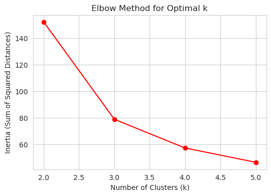
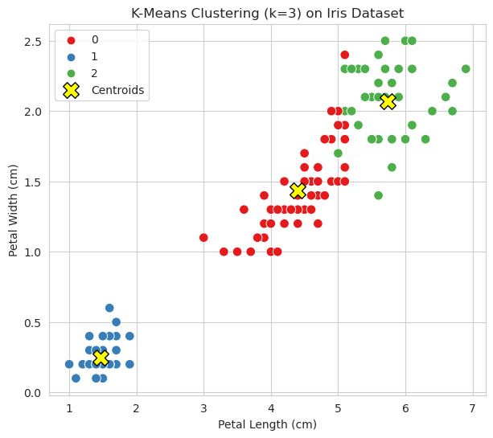

### 📖 مرحله سوم: اجرای K-Means روی Iris

---

## 🔹 اجرای K-Means برای مقادیر مختلف k

ابتدا الگوریتم رو برای مقادیر $k = 2, 3, 4, 5$ اجرا می‌کنیم تا ببینیم چطور داده‌ها خوشه‌بندی می‌شن.

```python
# Import KMeans
from sklearn.cluster import KMeans

# Run KMeans with different k values
inertias = []
for k in range(2, 6):
    model = KMeans(n_clusters=k, random_state=42, n_init=10)
    model.fit(df.iloc[:, :-1])
    inertias.append(model.inertia_)  # Sum of squared distances یا (میزان فشردگی یا کیفیت خوشه‌بندی)

# Print inertia values
print("Inertia for different k values:", inertias)
```
- وقتی شما n_init=10 را تعیین می‌کنید، یعنی به الگوریتم دستور می‌دهید:

* ۱۰ بار الگوریتم را با شروع‌های تصادفیِ متفاوت اجرا کن.
در هر بار اجرا، مدل را به صورت کامل تا رسیدن به نتیجه نهایی (همگرایی) پیش ببر.
در پایان، از بین این ۱۰ بار اجرا، بهترین مدل (یعنی مدلی که کمترین میزان inertia_ یا همان کمترین مجموع فواصل نقاط تا مراکز را داشته باشد) را به عنوان نتیجه نهایی انتخاب کن.
---

## 🔹 رسم نمودار Elbow (روش آرنج)

برای انتخاب k بهینه، از روش Elbow استفاده می‌کنیم:

```python
# Plot Elbow Method
plt.figure(figsize=(6, 4))
plt.plot(range(2, 6), inertias, marker='o', color='red')
plt.title("Elbow Method for Optimal k")
plt.xlabel("Number of Clusters (k)")
plt.ylabel("Inertia (Sum of Squared Distances)")
plt.grid(True)
plt.show()
```


🔎 توضیح:

* نمودار نشون می‌ده که بعد از $k=3$، کاهش Inertia خیلی کم می‌شه.
* بنابراین بهترین مقدار k برای این دیتاست **k=3** هست (که با تعداد کلاس‌های واقعی هم همخوانی داره).

---

## 🔹 اجرای K-Means با k=3

```python
# Fit KMeans with k=3
kmeans = KMeans(n_clusters=3, random_state=42, n_init=10)
df["cluster"] = kmeans.fit_predict(df.iloc[:, :-1])

# Show first rows with cluster labels
print(df.head())
```

---

## 🔹 ترسیم نمودار دوبعدی (Petal length vs Petal width)

```python
# Scatter plot of clusters
plt.figure(figsize=(7, 6))
sns.scatterplot(x=df["petal length (cm)"], 
                y=df["petal width (cm)"], 
                hue=df["cluster"], 
                palette="Set1", 
                s=70)
plt.scatter(kmeans.cluster_centers_[:, 2], 
            kmeans.cluster_centers_[:, 3], 
            s=200, c="yellow", marker="X", edgecolor="black", label="Centroids")
plt.title("K-Means Clustering (k=3) on Iris Dataset")
plt.xlabel("Petal Length (cm)")
plt.ylabel("Petal Width (cm)")
plt.legend()
plt.show()
```


🔎 توضیح نمودار:

* خوشه‌ها به‌خوبی شکل گرفتن.
* گونه **Setosa** کاملاً جداست.
* Versicolor و Virginica مقداری هم‌پوشانی دارن (که طبیعی هم هست).
* مراکز خوشه‌ها (Centroids) با علامت "X" زرد مشخص شدن.

---

✅ حالا ما موفق شدیم:

* k بهینه رو پیدا کنیم.
* خوشه‌ها رو روی نمودار دوبعدی ترسیم کنیم.

📌 در **مرحله چهارم** می‌ریم سراغ مقایسه برچسب‌های خوشه‌بندی با برچسب‌های واقعی و محاسبه معیارهای دقت مثل **Accuracy, Adjusted Rand Index, Silhouette Score**.

