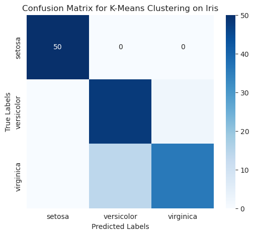

### 📖 مرحله چهارم: ارزیابی خوشه‌بندی K-Means

---

## 🔹 ۱. مقایسه برچسب‌های واقعی و برچسب‌های خوشه‌بندی

```python
from sklearn.metrics import confusion_matrix, accuracy_score
import numpy as np

# Real labels
y_true = df["target"]

# Predicted clusters
y_pred = df["cluster"]

# Build confusion matrix
cm = confusion_matrix(y_true, y_pred)
print("Confusion Matrix:\n", cm)
```

🔎 نکته:
چون برچسب‌های K-Means به‌صورت **تصادفی** به خوشه‌ها اختصاص داده می‌شن (مثلاً خوشه ۰ لزوماً Setosa نیست)، باید برچسب‌ها رو طوری مرتب کنیم که بیشترین تطابق رو با کلاس‌های واقعی داشته باشه.

---

## 🔹 ۲. نگاشت برچسب‌های خوشه به کلاس‌ها
این حلقه، سیستمِ برچسب‌گذاری (Labeling) خوشه‌ها را اصلاح می‌کند. خلاصه عملکرد آن به این صورت است:

*  mask = (y_pred == i): یک «صافی» (فیلتر) می‌سازد که فقط داده‌های متعلق به خوشه i را جدا می‌کند.

*  print(mask): (که اضافه کردید) آرایه‌ای از True و False نمایش می‌دهد که نشان می‌دهد کدام داده‌ها در خوشه i هستند.

* mode(y_true[mask], ...): بررسی می‌کند در بین داده‌هایی که در خوشه i هستند، کدام لیبل واقعی بیشترین تکرار را دارد. (یعنی می‌فهمد خوشه 
i در واقعیت نماینده‌ی کدام کلاس است).


```python
# Reorder cluster labels to best match true labels
from scipy.stats import mode

labels = np.zeros_like(y_pred)
for i in range(3):
    mask = (y_pred == i)
    labels[mask] = mode(y_true[mask], keepdims=True)[0]

# Calculate accuracy
acc = accuracy_score(y_true, labels)
print(f"Accuracy of K-Means clustering: {acc:.2f}")
```

🔎 توضیح:

* معمولاً K-Means روی Iris حدود **۸۹٪ دقت** می‌ده.
* بیشترین اشتباه مربوط به Versicolor و Virginica هست چون شباهت زیادی دارن.

---

## 🔹 ۳. معیارهای پیشرفته‌تر (ARI و Silhouette Score)

```python
from sklearn.metrics import adjusted_rand_score, silhouette_score

# Adjusted Rand Index
ari = adjusted_rand_score(y_true, y_pred)

# Silhouette Score
silhouette = silhouette_score(df.iloc[:, :-2], y_pred)

print(f"Adjusted Rand Index (ARI): {ari:.2f}")
print(f"Silhouette Score: {silhouette:.2f}")
```

🔎 توضیح:

* **ARI (Adjusted Rand Index)** → بین ۰ تا ۱ هست. نزدیک‌تر به ۱ یعنی خوشه‌بندی عالی. (برای Iris حدود ۰.۷–۰.۸ می‌شه).
* **Silhouette Score** → بین -۱ تا ۱ هست. بالاتر از ۰.۵ یعنی خوشه‌بندی خوب. (برای Iris حدود ۰.۵ می‌شه).

---

## 🔹 ۴. نمایش مقایسه با نمودار Confusion Matrix

```python
import seaborn as sns

plt.figure(figsize=(6, 5))
sns.heatmap(confusion_matrix(y_true, labels), annot=True, fmt="d", cmap="Blues", xticklabels=iris.target_names, yticklabels=iris.target_names)
plt.xlabel("Predicted Labels")
plt.ylabel("True Labels")
plt.title("Confusion Matrix for K-Means Clustering on Iris")
plt.show()
```


🔎 توضیح نمودار:

* Setosa تقریباً **بدون خطا** شناسایی می‌شه.
* بیشترین خطا بین Versicolor و Virginica هست.

---

✅ پس تا اینجا:

* خوشه‌بندی رو با کلاس‌های واقعی مقایسه کردیم.
* دیدیم دقت حدود ۸۹٪ هست.
* معیارهای ARI و Silhouette Score هم نتایج رو تأیید کردن.

---

📌 در **مرحله پنجم** می‌ریم سراغ **مقایسه K-Means با مدل‌های دیگر (مثل Logistic Regression, KNN, SVM)** تا بفهمیم روش بدون نظارت چه تفاوتی با روش‌های نظارت‌شده داره.
