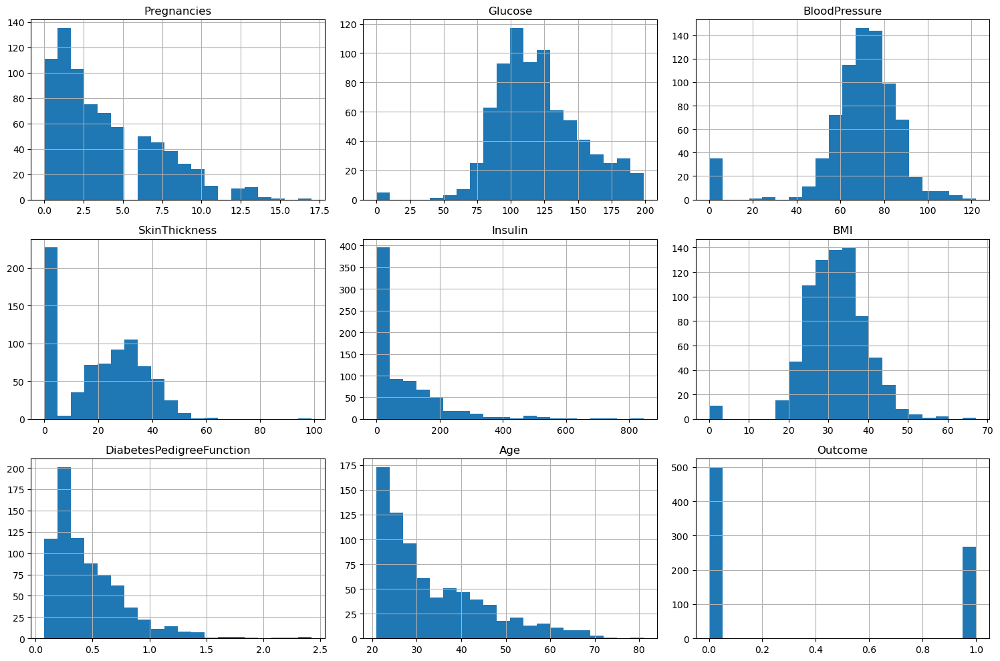
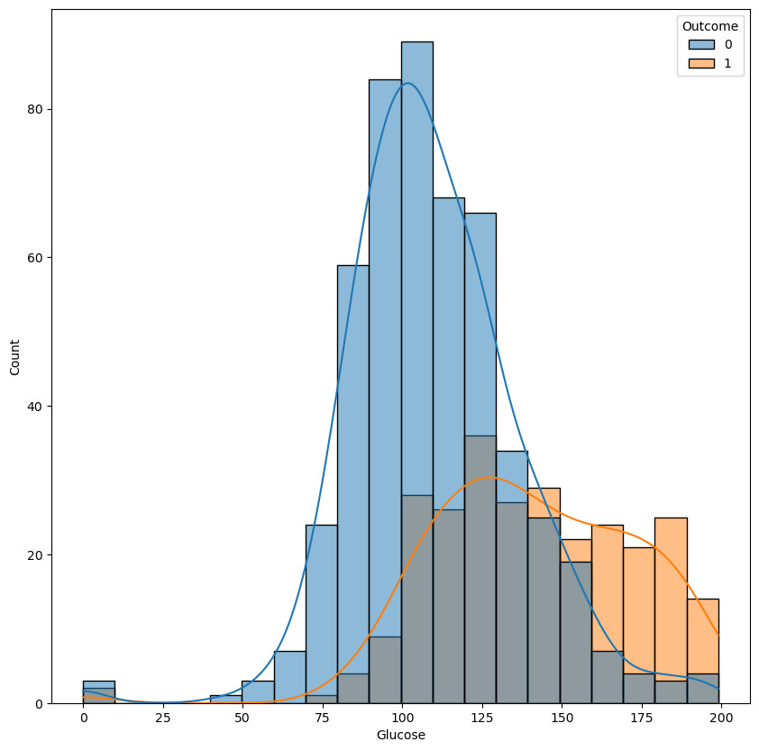
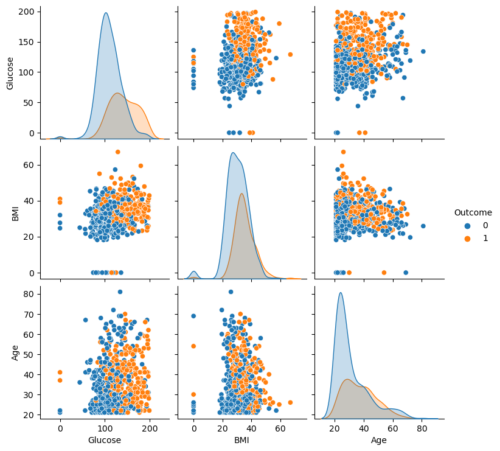

## 📖 صفحه ۴: تحلیل داده‌ها با نمودارهای اولیه

✍️ نویسنده: سیامک عباس‌نژاد

---

### 🔹 اهمیت تحلیل داده قبل از مدل‌سازی

قبل از اینکه مدل KNN را اجرا کنیم، باید داده‌ها را بهتر بشناسیم. نمودارها به ما کمک می‌کنند:

* توزیع هر ویژگی را ببینیم.
* الگوهای پنهان در داده‌ها را کشف کنیم.
* وجود داده‌های غیرعادی (Outliers) را شناسایی کنیم.

---

### 🔹 رسم هیستوگرام برای ویژگی‌ها

یکی از روش‌های ساده، هیستوگرام است.

```python
import matplotlib.pyplot as plt

data.hist(bins=20, figsize=(15, 10))
plt.tight_layout()
plt.show()
```
---

---

📌 با این دستور، توزیع تمام ویژگی‌ها در قالب هیستوگرام نمایش داده می‌شود.

* Glucose بیشتر در بازه 100 تا 150 متمرکز است.
* فشار خون (BloodPressure) بیشتر حول 70 قرار دارد.
* BMI بیشتر بین 25 تا 40 دیده می‌شود.

---

### 🔹 مقایسه‌ی توزیع ویژگی‌ها بر اساس برچسب Outcome

برای درک بهتر، یک ویژگی مهم مثل **Glucose** را بین بیماران دیابتی و غیردیابتی مقایسه می‌کنیم.

```python
import seaborn as sns

plt.figure(figsize=(8, 5))
sns.histplot(data=data, x="Glucose", hue="Outcome", kde=True, bins=30)
plt.title("Distribution of Glucose for Diabetic and Non-Diabetic Patients")
plt.show()
```
---

---
📌 نتیجه: بیماران دیابتی معمولاً سطح قند خون بالاتری دارند.

---

### 🔹 نمایش ارتباط بین دو ویژگی (Pairplot)

برای بررسی تعامل چند ویژگی با هم می‌توان از `pairplot` استفاده کرد:

```python
sns.pairplot(data[["Glucose", "BMI", "Age", "Outcome"]], hue="Outcome")
plt.show()
```
---

---
📌 نتیجه:

* افراد با **Glucose بالا و BMI بالا** بیشتر در گروه دیابتی‌ها قرار می‌گیرند.
* سن نیز عاملی مؤثر است، چون افراد مسن‌تر بیشتر در معرض دیابت قرار دارند.

---

### 🔹 نتیجه‌گیری اولیه از تحلیل داده

* **Glucose** و **BMI** از مهم‌ترین ویژگی‌ها برای تشخیص دیابت هستند.
* داده‌ها الگوهای مشخصی بین بیماران دیابتی و غیردیابتی نشان می‌دهند.
* این تحلیل‌ها کمک می‌کند در مراحل بعدی (Feature Selection و مدل‌سازی) تصمیمات دقیق‌تری بگیریم.

