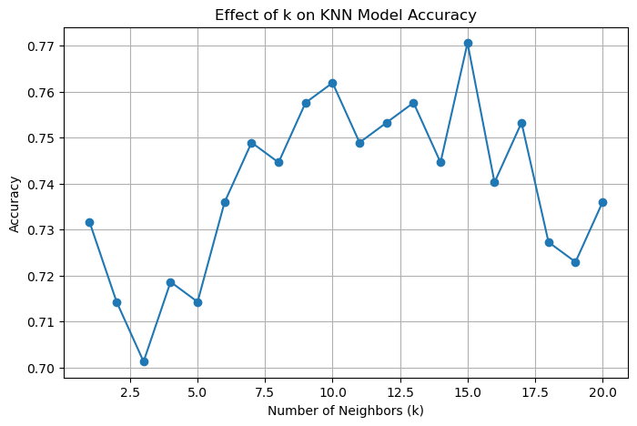

## 📖 صفحه ۶: انتخاب k مناسب در الگوریتم KNN

✍️ نویسنده: سیامک عباس‌نژاد

---

### 🔹 چرا انتخاب k مهم است؟

در الگوریتم KNN، تعداد همسایه‌ها یعنی $k$ نقش بسیار مهمی دارد:

* اگر $k$ خیلی کوچک باشد (مثلاً ۱ یا ۲)، مدل به نویز (Noise) حساس می‌شود.
* اگر $k$ خیلی بزرگ باشد، مدل بیش از حد هموار می‌شود و دقت کاهش می‌یابد.

پس باید مقدار بهینه‌ی k را پیدا کنیم.

---

### 🔹 پیاده‌سازی بررسی مقادیر مختلف k

```python
import matplotlib.pyplot as plt
from sklearn.metrics import accuracy_score

accuracies = []

# Test k values from 1 to 20
for k in range(1, 21):
    knn = KNeighborsClassifier(n_neighbors=k)
    knn.fit(X_train, y_train)
    y_pred = knn.predict(X_test)
    acc = accuracy_score(y_test, y_pred)
    accuracies.append(acc)

# Plot the results
plt.figure(figsize=(8, 5))
plt.plot(range(1, 21), accuracies, marker='o')
plt.xlabel("Number of Neighbors (k)")
plt.ylabel("Accuracy")
plt.title("Effect of k on KNN Model Accuracy")
plt.grid(True)
plt.show()
```
---

---

### 🔹 تحلیل نمودار

📌 در نمودار معمولاً دیده می‌شود که:

* برای k های خیلی کوچک (مثلاً ۱ یا ۲)، دقت پایین است چون مدل بیش از حد به داده‌های خاص وابسته می‌شود.
* دقت در مقادیر میانی (مثلاً ۷ تا ۱۵) به بالاترین مقدار خود می‌رسد.
* بعد از یک حد خاص، افزایش k باعث کاهش دقت می‌شود چون مدل بیش از حد ساده می‌شود.

---

### 🔹 نتیجه انتخاب k

در اکثر اجراها روی دیتاست دیابت:

* بهترین k معمولاً بین **۷ تا ۱۷** است.
* انتخاب k=9 یا k=11 اغلب دقت بالاتری نسبت به k=5 می‌دهد.

