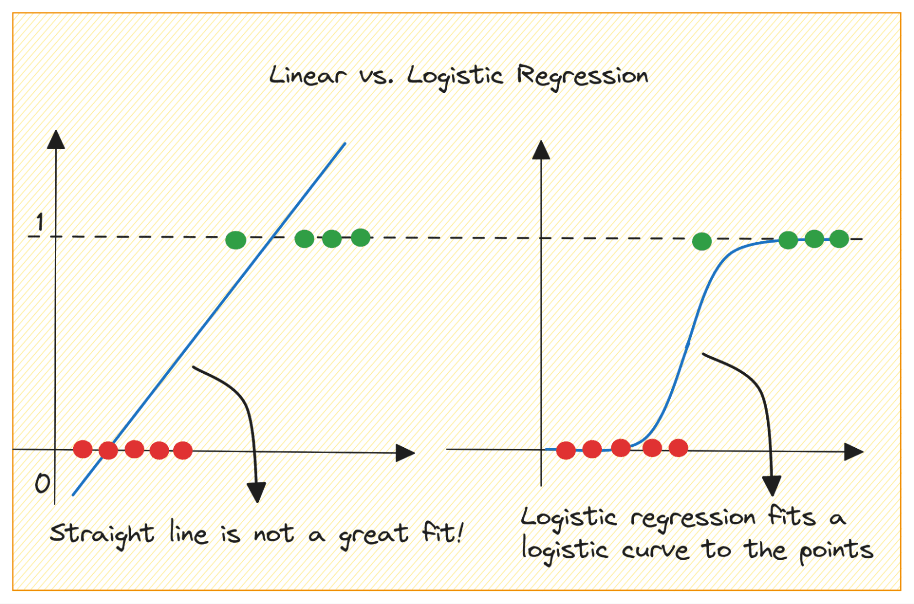

## 📖 صفحه ۲: معرفی رگرسیون لجستیک و کاربردها

✍️ نویسنده: سیامک عباس‌نژاد

رگرسیون لجستیک (**Logistic Regression**) یکی از پرکاربردترین الگوریتم‌های یادگیری ماشین است که برای مسائل **طبقه‌بندی دودویی (Binary Classification)** و در برخی موارد برای مسائل چندکلاسه (Multiclass Classification) استفاده می‌شود.

برخلاف نامش، این الگوریتم در واقع یک روش رگرسیون عددی نیست، بلکه بر پایه‌ی محاسبه‌ی احتمال و تصمیم‌گیری عمل می‌کند. ایده‌ی اصلی آن این است که ورودی‌ها (ویژگی‌ها یا **Features**) را دریافت کرده و با استفاده از ضرایب (**Weights**) و یک تابع ریاضی به نام **تابع لجستیک (Sigmoid Function)**، احتمال تعلق نمونه به یک دسته خاص را برمی‌گرداند.

---

---

### 🔹 تفاوت با رگرسیون خطی

در **رگرسیون خطی**، خروجی یک مقدار پیوسته مانند قیمت خانه یا دما است.

در **رگرسیون لجستیک**، خروجی یک احتمال بین ۰ و ۱ است که برای تصمیم‌گیری دسته‌بندی استفاده می‌شود.

برای مثال، اگر خروجی ۰.۸۵ باشد، یعنی با احتمال ۸۵٪ نمونه متعلق به کلاس مثبت (مثلاً بیمار مبتلا به دیابت) است.

---

### 🔹 تابع سیگموید (Sigmoid Function)

تابع سیگموید به صورت زیر تعریف می‌شود:

$$
\sigma(z) = \frac{1}{1 + e^{-z}}
$$

که در آن:

$z = w \cdot x + b$ ( ترکیب خطی ویژگی‌هاست )

 خروجی این تابع همیشه عددی بین ۰ و ۱ است.

این ویژگی باعث شده که تابع سیگموید برای محاسبه‌ی احتمال در رگرسیون لجستیک ایده‌آل باشد.

---

### 🔹 کاربردهای رگرسیون لجستیک

رگرسیون لجستیک یکی از پرکاربردترین مدل‌ها در علوم داده است و در حوزه‌های مختلف استفاده می‌شود:

1. **پزشکی:** تشخیص بیماری‌ها (مانند دیابت، سرطان، بیماری قلبی).
2. **مالی:** شناسایی تراکنش‌های مشکوک به تقلب.
3. **بازاریابی:** پیش‌بینی احتمال خرید مشتری یا ترک سرویس.
4. **امنیت:** تشخیص حملات سایبری یا ورودهای غیرمجاز.
5. **پردازش زبان طبیعی (NLP):** تحلیل احساسات متن‌ها (مثبت یا منفی).

---

در پروژه‌ی این کتاب، ما از رگرسیون لجستیک برای **تشخیص دیابت** استفاده می‌کنیم. این مسأله به‌خوبی نشان می‌دهد که چگونه یک مدل ساده می‌تواند در مسائل حیاتی پزشکی کاربرد داشته باشد.

