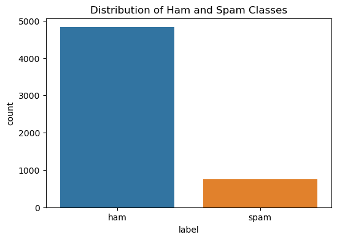

# 📖 فصل ۳: معرفی دیتاست اسپم ایمیل و آماده‌سازی داده‌ها

### 🔹 معرفی دیتاست اسپم ایمیل

در این پروژه از دیتاستی استفاده می‌کنیم که شامل پیام‌های متنی اسپم (Spam) و عادی (Ham) است. هر ردیف یک پیام و هر ستون شامل اطلاعاتی درباره‌ی محتوای آن است. ستون برچسب نیز مشخص می‌کند که پیام اسپم است یا خیر.

* **Spam (۱)** = پیام ناخواسته
* **Ham (۰)** = پیام عادی

### 🔹 بارگذاری داده‌ها در پایتون

```python
# Importing essential libraries
import pandas as pd
import matplotlib.pyplot as plt
import seaborn as sns

# Load dataset
df = pd.read_csv('spam.csv', encoding='latin-1')

# Keep only necessary columns
df = df[['v1', 'v2']]
df.columns = ['label', 'message']
```

---

### 🔹 تحلیل اولیه: توزیع برچسب‌ها

پیش از مدل‌سازی، باید بدانیم چه تعداد پیام اسپم و عادی داریم.

```python
# Count distribution of labels
plt.figure(figsize=(6, 4))
sns.countplot(data=df, x='label')
plt.title('Distribution of Ham and Spam Classes')
plt.show()
```


📌 نتیجه: معمولاً تعداد پیام‌های عادی (Ham) بسیار بیشتر از پیام‌های اسپم است.

---