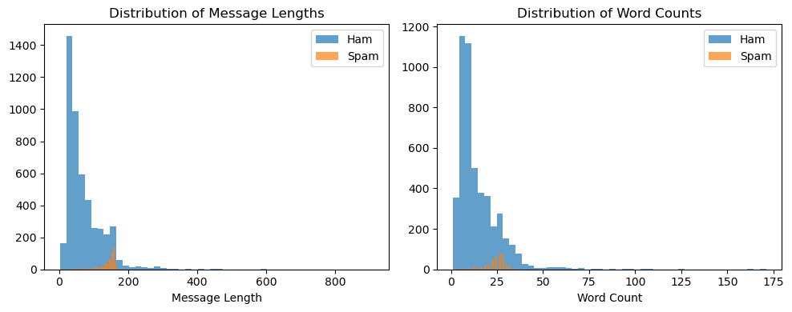

# 📖 فصل ۴: تحلیل داده‌ها و استخراج ویژگی‌ها

### 🔹 بررسی طول و تعداد کلمات پیام‌ها

```python
# Add new features: message length and word count
df['message_length'] = df['message'].apply(len)
df['word_count'] = df['message'].apply(lambda x: len(x.split()))

plt.figure(figsize=(10, 4))

# Distribution of message lengths
plt.subplot(1, 2, 1)
plt.hist(df[df['label'] == 'ham']['message_length'], bins=50, alpha=0.7, label='Ham')
plt.hist(df[df['label'] == 'spam']['message_length'], bins=50, alpha=0.7, label='Spam')
plt.xlabel('Message Length')
plt.legend()
plt.title('Distribution of Message Lengths')

# Distribution of word counts
plt.subplot(1, 2, 2)
plt.hist(df[df['label'] == 'ham']['word_count'], bins=50, alpha=0.7, label='Ham')
plt.hist(df[df['label'] == 'spam']['word_count'], bins=50, alpha=0.7, label='Spam')
plt.xlabel('Word Count')
plt.legend()
plt.title('Distribution of Word Counts')

plt.tight_layout()
plt.show()
```



📊 **نتیجه:** پیام‌های اسپم معمولاً طول و تعداد کلمات متفاوتی با پیام‌های عادی دارند.

---

### 🔹 پاک‌سازی و تحلیل کلمات پرتکرار

```python
import re
from collections import Counter

# Function to clean text
def clean_text(text):
    text = re.sub(r'\W', ' ', text)  # Remove special characters
    text = re.sub(r'\s+', ' ', text)  # Remove extra spaces
    return text.lower().strip()

# Apply cleaning
df['cleaned_message'] = df['message'].apply(clean_text)

# Function to get top words for a label
def get_top_words(label, n=10):
    text = ' '.join(df[df['label'] == label]['cleaned_message'])
    words = text.split()
    return Counter(words).most_common(n)

print("Most common words in spam:", get_top_words('spam', 10))
print("Most common words in ham:", get_top_words('ham', 10))
# output:

label                                            message  message_length  \
0      ham  Go until jurong point, crazy.. Available only ...             111   
1      ham                      Ok lar... Joking wif u oni...              29   
2     spam  Free entry in 2 a wkly comp to win FA Cup fina...             155   
3      ham  U dun say so early hor... U c already then say...              49   
4      ham  Nah I don't think he goes to usf, he lives aro...              61   
...    ...                                                ...             ...   
5567  spam  This is the 2nd time we have tried 2 contact u...             161   
5568   ham              Will Ì_ b going to esplanade fr home?              37   
5569   ham  Pity, * was in mood for that. So...any other s...              57   
5570   ham  The guy did some bitching but I acted like i'd...             125   
5571   ham                         Rofl. Its true to its name              26   

      word_count                                    cleaned_message  
0             20  go until jurong point crazy available only in ...  
1              6                            ok lar joking wif u oni  
2             28  free entry in 2 a wkly comp to win fa cup fina...  
3             11        u dun say so early hor u c already then say  
4             13  nah i don t think he goes to usf he lives arou...  
...          ...                                                ...  
5567          30  this is the 2nd time we have tried 2 contact u...  
5568           8               will ì_ b going to esplanade fr home  
5569          10  pity was in mood for that so any other suggest...  
5570          26  the guy did some bitching but i acted like i d...  
5571           6                          rofl its true to its name  

[5572 rows x 5 columns]
Most common words in spam messages:
[('to', 688), ('a', 377), ('call', 355), ('å', 299), ('you', 297), ('your', 264), ('free', 224), ('2', 206), ('the', 206), ('for', 203)]

Most common words in ham messages:
[('i', 2940), ('you', 1943), ('to', 1554), ('the', 1122), ('a', 1056), ('u', 1018), ('and', 857), ('in', 818), ('me', 772), ('my', 750)]
```

📌 مشاهده می‌کنیم که کلماتی مثل **free, win, urgent, prize** در پیام‌های اسپم بیشتر تکرار می‌شوند.

---

### 🔹 ساخت ویژگی‌های عددی (Feature Engineering)

```python
import numpy as np

# Create numerical features
df['char_count'] = df['message'].apply(lambda x: len(x.replace(" ", "")))  # Characters count
df['avg_word_length'] = df['message'].apply(lambda x: np.mean([len(w) for w in x.split()]) if len(x.split()) > 0 else 0)
df['exclamation_count'] = df['message'].apply(lambda x: x.count('!'))  # Exclamations
df['question_count'] = df['message'].apply(lambda x: x.count('?'))  # Questions
df['digit_count'] = df['message'].apply(lambda x: sum(c.isdigit() for c in x))  # Digits
df['has_free'] = df['message'].str.contains('free', case=False, na=False).astype(int)
df['has_win'] = df['message'].str.contains('win', case=False, na=False).astype(int)
df['has_urgent'] = df['message'].str.contains('urgent', case=False, na=False).astype(int)
df['has_call'] = df['message'].str.contains('call', case=False, na=False).astype(int)
# output:
Spam Keywords in the Data:
free: 265
win: 166
winner: 23
prize: 89
urgent: 69
claim: 116
text: 224
txt: 194
cash: 81
prize: 89
```

📊 این ویژگی‌ها به مدل کمک می‌کنند الگوهای اسپم را سریع‌تر شناسایی کند.

---
