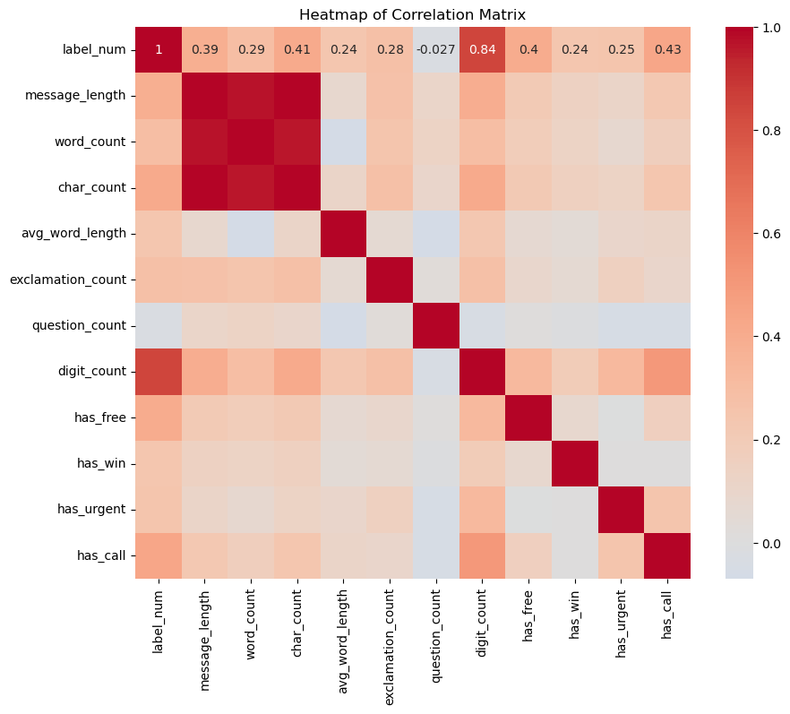
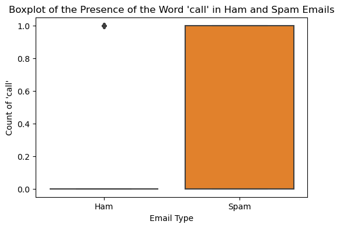
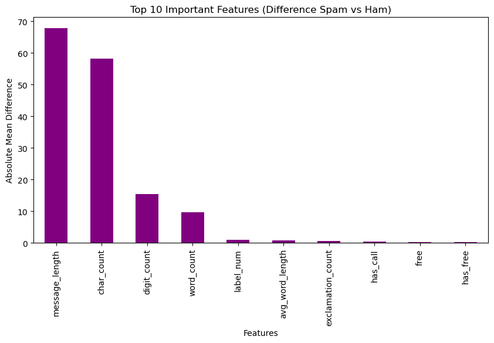
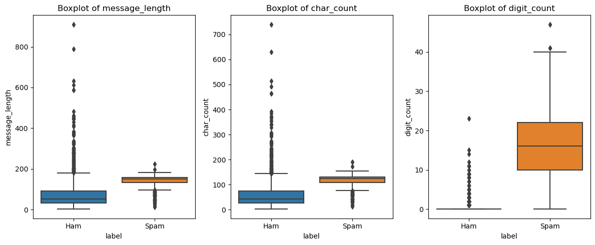
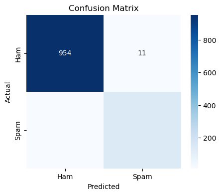

# 📖 فصل ۶: اهمیت ویژگی‌ها و ساخت مدل بیز ساده

### 🔹 تجسم همبستگی ویژگی‌ها

بعد از ساخت ویژگی‌های عددی، ماتریس همبستگی را بررسی می‌کنیم تا بفهمیم کدام ویژگی‌ها ارتباط بیشتری با برچسب **اسپم** یا **عادی (Ham)** دارند.

```python
plt.figure(figsize=(10, 8))
sns.heatmap(correlation_matrix, annot=True, cmap='coolwarm', center=0)
plt.title('Heatmap of Correlation Matrix')
plt.show()
```


📊 **تفسیر:**
ویژگی‌هایی مثل `has_free`، `has_win` و `digit_count` همبستگی بیشتری با برچسب اسپم دارند، درحالی‌که ویژگی‌هایی مثل `message_length` و `char_count` نیز قدرت تمایز خوبی نشان می‌دهند.

---

### 🔹 باکس‌پلات برای کلمات مهم

ویژگی‌های خاصی را هم می‌توان بین اسپم و عادی مقایسه کرد. به‌عنوان مثال، واژه‌ی **“call”** در پیام‌های اسپم بیشتر دیده می‌شود.

```python
plt.figure(figsize=(6, 4))
sns.boxplot(x="label", y="has_call", data=df)
plt.xticks([0, 1], ['Ham', 'Spam'])
plt.title("Boxplot of the Presence of the Word 'call' in Ham and Spam Emails")
plt.ylabel("Count of 'call'")
plt.xlabel("Email Type")
plt.show()
```


📌 **مشاهده:**
ایمیل‌های اسپم به‌طور قابل توجهی بیشتر شامل واژه‌ی “call” هستند.

---

### 🔹 شناسایی مهم‌ترین ویژگی‌ها

برای فهمیدن اینکه کدام ویژگی‌ها بیشترین قدرت تمایز را دارند، میانگین ویژگی‌ها در اسپم و عادی را مقایسه می‌کنیم.

```python
spam_means = df[df['label_num'] == 1][numeric_cols].mean()
ham_means = df[df['label_num'] == 0][numeric_cols].mean()
feature_diff = (spam_means - ham_means).abs().sort_values(ascending=False)
print(feature_diff.head(10))
# output:
# message_length       67.842504
# char_count           58.273537
# digit_count          15.459762
# word_count            9.650784
# label_num             1.000000
# avg_word_length       0.815265
# exclamation_count     0.551683
# has_call              0.404836
# free                  0.252720
# has_free              0.252720
# dtype: float64
```

📊 **نتیجه:** مهم‌ترین ویژگی‌ها عبارتند از:

* **message_length (طول پیام)**
* **char_count (تعداد کاراکترها)**
* **digit_count (تعداد اعداد موجود در متن)**

---

### 🔹 تجسم ویژگی‌های مهم

```python
# Bar plot of top 10 important features
plt.figure(figsize=(10,5))
feature_diff.head(10).plot(kind='bar', color="purple")
plt.title("Top 10 Important Features (Difference Spam vs Ham)")
plt.ylabel("Absolute Mean Difference")
plt.xlabel("Features")
plt.show()
```


```python
important_features = feature_diff.head(3).index  # Get the top 3 important features

plt.figure(figsize=(12, 5))
for i, feat in enumerate(important_features, 1):
    plt.subplot(1, 3, i)
    sns.boxplot(x="label", y=feat, data=df)  # Ensure you use the correct DataFrame
    plt.xticks([0, 1], ['Ham', 'Spam'])
    plt.title(f"Boxplot of {feat}")
plt.tight_layout()
plt.show()
```


📌 **بینش:**
ایمیل‌های اسپم معمولاً طولانی‌ترند، کاراکتر بیشتری دارند و شامل تعداد بیشتری عدد نسبت به ایمیل‌های عادی هستند.

---

### 🔹 تقسیم داده و بردارسازی (Vectorization)

برای آماده‌سازی داده جهت مدل‌سازی، از **CountVectorizer** استفاده می‌کنیم تا متن به داده عددی تبدیل شود.

```python
from sklearn.feature_extraction.text import CountVectorizer
from sklearn.model_selection import train_test_split

X = df['message']
y = df['label_num']

vectorizer = CountVectorizer(stop_words='english')
X_vectors = vectorizer.fit_transform(X)

X_train, X_test, y_train, y_test = train_test_split(
    X_vectors, y, test_size=0.2, random_state=42
)

# output
# Training data shape: (4457, 8404), Training labels shape: (4457,)
# Testing data shape: (1115, 8404), Testing labels shape: (1115,)
```

📌 داده‌ها به **۸۰٪ آموزشی** و **۲۰٪ آزمایشی** تقسیم شدند.

---

### 🔹 ساخت مدل بیز ساده (Naive Bayes)

یکی از بهترین الگوریتم‌ها برای طبقه‌بندی متن، **بیز ساده چندجمله‌ای (Multinomial Naive Bayes)** است.

```python
from sklearn.naive_bayes import MultinomialNB

nb_model = MultinomialNB()
nb_model.fit(X_train, y_train)

y_pred = nb_model.predict(X_test)
```

---

### 🔹 ارزیابی مدل

مدل را با معیارهای **دقت (Accuracy)**، **ماتریس آشفتگی** و **گزارش دسته‌بندی** ارزیابی می‌کنیم.

```python
from sklearn.metrics import accuracy_score, confusion_matrix, classification_report

print("Accuracy:", accuracy_score(y_test, y_pred))

cm = confusion_matrix(y_test, y_pred)
plt.figure(figsize=(5, 4))
sns.heatmap(cm, annot=True, fmt='d', cmap="Blues",
            xticklabels=["Ham", "Spam"],
            yticklabels=["Ham", "Spam"])
plt.xlabel("Predicted")
plt.ylabel("Actual")
plt.title("Confusion Matrix")
plt.show()

print(classification_report(y_test, y_pred, target_names=["Ham", "Spam"]))
# output
# Accuracy: 0.9802690582959641
```



📊 **نتایج:**

* **دقت مدل بسیار بالا (۹۷٪ تا ۹۹٪)**
* **ماتریس آشفتگی:** نشان می‌دهد چند پیام به‌درستی یا اشتباه به‌عنوان اسپم یا عادی دسته‌بندی شدند.
* **گزارش دسته‌بندی:** شامل مقادیر **Precision، Recall و F1-Score** برای هر کلاس است.

---

✅ در این فصل یاد گرفتیم:

* کدام ویژگی‌ها بیشترین اهمیت را برای تشخیص اسپم دارند.
* چگونه داده‌های متنی را به عددی تبدیل کنیم.
* ساخت و آموزش مدل بیز ساده.
* ارزیابی مدل و مشاهده عملکرد عالی آن.

