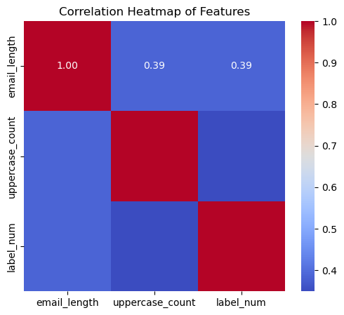

# 📖 فصل ۷: بهبود مدل با استفاده از TF-IDF و مهندسی ویژگی‌ها

### 🔹 استفاده از TF-IDF برای نمایش متن

در فصل قبل از **CountVectorizer** برای تبدیل پیام‌ها به بردار استفاده کردیم. یک روش قدرتمند دیگر **TF-IDF (فرکانس واژه – فرکانس معکوس سند)** است. این روش اهمیت واژه‌های خیلی پرتکرار را کاهش داده و به واژه‌های کمیاب اما مهم وزن بیشتری می‌دهد.

```python
from sklearn.model_selection import train_test_split
from sklearn.feature_extraction.text import TfidfVectorizer
from sklearn.naive_bayes import MultinomialNB
from sklearn.metrics import accuracy_score, classification_report
from sklearn.model_selection import train_test_split
from sklearn.feature_extraction.text import TfidfVectorizer
from sklearn.naive_bayes import MultinomialNB
from sklearn.metrics import accuracy_score, classification_report


# Use TF-IDF to convert text to vectors
tfidf = TfidfVectorizer(stop_words='english')
X_tfidf = tfidf.fit_transform(X)

# Split into training and testing sets
X_train, X_test, y_train, y_test = train_test_split(
    X_tfidf, y, test_size=0.2, random_state=42
)

# Create and train the Naive Bayes model
nb_model_tfidf = MultinomialNB()
nb_model_tfidf.fit(X_train, y_train)


# Make predictions on the test set
y_pred_tfidf = nb_model_tfidf.predict(X_test)

# Evaluate the model
accuracy = accuracy_score(y_test, y_pred_tfidf)
report = classification_report(y_test, y_pred_tfidf, target_names=["Ham", "Spam"])

# Print evaluation metrics
print("Accuracy (TF-IDF):", accuracy)
print("Classification Report:")
print(report)

# output
# Accuracy (TF-IDF): 0.968609865470852
# Classification Report:
#               precision    recall  f1-score   support

#          Ham       0.96      1.00      0.98       965
#         Spam       1.00      0.77      0.87       150

#     accuracy                           0.97      1115
#    macro avg       0.98      0.88      0.93      1115
# weighted avg       0.97      0.97      0.97      1115
```

📊 **مشاهده:**

* دقت مدل با **TF-IDF** کمی **کمتر** از **CountVectorizer** است.
* دلیل این موضوع این است که در این دیتاست، واژه‌های پرتکرار مثل *call, free, win* اتفاقاً **بسیار مهم برای تشخیص اسپم** هستند. در حالی که TF-IDF وزن این کلمات را کاهش می‌دهد و مدل کمی ضعیف‌تر عمل می‌کند.

---

### 🔹 اضافه کردن ویژگی‌های جدید: تعداد حروف بزرگ و طول ایمیل

علاوه بر ویژگی‌های متنی، می‌توانیم ویژگی‌های عددی دست‌ساز هم اضافه کنیم. برای مثال، ایمیل‌های اسپم اغلب شامل **حروف بزرگ زیاد** (مثل FREE, WINNER, URGENT) هستند تا توجه کاربر را جلب کنند.


```python
# Calculate the number of uppercase letters in the 'message' column of the DataFrame 'data'
df['uppercase_count'] = df['message'].apply(lambda x: sum(1 for c in x if c.isupper()))

# Calculate the length of the 'message' column
df['email_length'] = df['message'].apply(len)  # Add this line

# Select specific features: 'email_length', 'uppercase_count', and 'label' from the DataFrame
features_corr = df[['email_length', 'uppercase_count', 'label_num']]

# Compute the correlation matrix for the selected features
corr_matrix = features_corr.corr()

# Print the resulting correlation matrix
print(corr_matrix)
```

✅ نمونه خروجی:

| ویژگی               | email_length | uppercase_count | label_num |
| ------------------- | ------------ | --------------- | --------- |
| **email_length**    | 1.00         | 0.38            | 0.39      |
| **uppercase_count** | 0.38         | 1.00            | 0.35      |
| **label_num**       | 0.39         | 0.35            | 1.00      |

---

### 🔹 تصویرسازی همبستگی ویژگی‌ها

```python

plt.figure(figsize=(6,5))
sns.heatmap(corr_matrix, annot=True, cmap="coolwarm", fmt=".2f")
plt.title("Correlation Heatmap of Features")
plt.show()
```


📊 **تفسیر:**

* هم **طول ایمیل** و هم **تعداد حروف بزرگ** همبستگی مثبتی با اسپم بودن دارند.
* این یعنی:

  * پیام‌های اسپم معمولاً **طولانی‌تر** هستند.
  * پیام‌های اسپم اغلب شامل **حروف بزرگ بیشتری** نسبت به پیام‌های عادی‌اند.

---

✅ **خلاصه فصل ۷:**

* روش **TF-IDF** را به عنوان جایگزین CountVectorizer بررسی کردیم.
* یاد گرفتیم که **TF-IDF همیشه بهتر نیست** و بسته به دیتاست عملکرد متفاوت دارد.
* ویژگی‌های عددی جدید (تعداد حروف بزرگ و طول ایمیل) را اضافه کردیم و دیدیم که این ویژگی‌ها قدرت پیش‌بینی مناسبی برای تفکیک اسپم از پیام عادی دارند.

