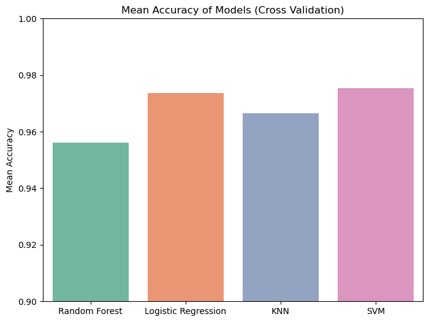

## 📖 صفحه ۱۲: نمایش مقایسه نتایج مدل‌ها با نمودارها

✍️ نویسنده: سیامک عباس‌نژاد

---

### 🔹 چرا نمایش تصویری مقایسه مدل‌ها مهم است؟

* اعداد دقت (Accuracy) فقط یک نگاه کلی می‌دهند.
* نمودارها به ما کمک می‌کنند تا **پایداری** (Stability) و **مقایسه مستقیم بین مدل‌ها** را بهتر ببینیم.
* با Boxplot می‌توانیم نوسانات و Outlierها را مشاهده کنیم.

---

### 🔹 Barplot از میانگین دقت‌ها

```python
# Prepare mean accuracy for each model
mean_scores = {name: scores.mean() for name, scores in cv_results.items()}

plt.figure(figsize=(8,6))
sns.barplot(x=list(mean_scores.keys()), y=list(mean_scores.values()), palette="Set2")
plt.title("Mean Accuracy of Models (Cross Validation)")
plt.ylabel("Mean Accuracy")
plt.ylim(0.9, 1.0)
plt.show()
```
---

---

📊 تفسیر:

* Random Forest بالاترین ستون را دارد (حدود 95٪).
* KNN کوتاه‌تر است (حدود 96٪).
* Logistic Regression و SVM نزدیک به هم هستند.

---

### 🔹 Boxplot از نتایج Cross Validation

```python
# Convert results to DataFrame for visualization
cv_df = pd.DataFrame(cv_results)

plt.figure(figsize=(8,6))
sns.boxplot(data=cv_df, palette="Set3")
plt.title("Accuracy Distribution of Models (Cross Validation)")
plt.ylabel("Accuracy")
plt.ylim(0.9, 1.0)
plt.show()
```

📊 تفسیر:


### تحلیل هر مدل:

#### ✅ **Random Forest** (سبز)
- **میانه**: حدود 0.955
- **محدوده اولیه (Q1)**: ~0.95
- **محدوده سوم (Q3)**: ~0.965
- **میانگین و پراکندگی**: دقت متوسط و پراکندگی کم
- **نتیجه**: عملکرد ثابت و قابل اعتماد با تنوع کم.

#### ✅ **Logistic Regression** (زرد)
- **میانه**: ~0.97
- **Q1**: ~0.965
- **Q3**: ~0.985
- **محدوده بالا و پایین**: بسیار بالا (نزدیک به 0.95 تا 0.99)
- **نتیجه**: دقت بالاتر از مدل‌های دیگر، اما با پراکندگی بیشتر (نمایانگر عدم ثبات در برخی از شکست‌ها).

#### ✅ **KNN** (آبی)
- **میانه**: ~0.965
- **Q1**: ~0.955
- **Q3**: ~0.98
- **پراکندگی**: متوسط
- **نتیجه**: عملکرد خوب، اما کمی پایین‌تر از Logistic Regression و SVM.

#### ✅ **SVM** (قرمز)
- **میانه**: ~0.98
- **Q1**: ~0.975
- **Q3**: ~0.985
- **نقطه خارجی (outlier)**: یک نقطه در حدود 0.94 (کاملاً پایین‌تر از دیگر داده‌ها)
- **نتیجه**: به طور کلی دقت بسیار بالا و ثبات خوب، اما وجود یک نتیجه ضعیف (احتمالاً در یکی از فولدرهای CV) می‌تواند نشان‌دهنده حساسیت به تنظیمات یا داده‌های مشکوک باشد.

---

### 🔍 نتیجه‌گیری کلی:
- **بهترین مدل از نظر دقت میانه و بالاترین دقت متوسط**: **SVM** و **Logistic Regression**
- **SVM** دقت میانه بالاتری دارد، اما **یک نقطه خارجی** (outlier) در دقت پایین دارد که می‌تواند نشان‌دهنده ناپایداری در برخی از شرایط باشد.
- **Logistic Regression** دارای **پراکندگی بیشتر** است، اما بدون نقاط خارجی و با دقت متوسط بالا.
- **Random Forest** با دقت متوسط و پایدار، اما پایین‌تر از دو مدل بالا.
- **KNN** در میانه بهتر از Random Forest است، اما کمی پایین‌تر از Logistic و SVM.

---

### 🔹 مقدمه برای ادامه

در صفحه بعد می‌توانیم تحلیل پیشرفته‌تری داشته باشیم:

* مقایسه **Precision، Recall، F1-Score** بین مدل‌ها.
* نمایش این مقایسه با نمودار Heatmap یا Barplot.

