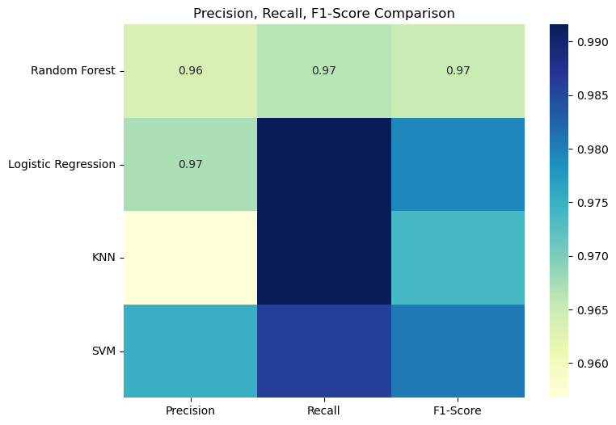

## 📖 صفحه ۱۳: مقایسه Precision، Recall و F1-Score بین مدل‌ها

✍️ نویسنده: سیامک عباس‌نژاد

---

### 🔹 چرا فقط Accuracy کافی نیست؟

اگرچه دقت (Accuracy) معیار مهمی است، اما در مسائل پزشکی مثل **تشخیص سرطان سینه** باید معیارهای دیگری را هم در نظر بگیریم:

* **Precision (دقت مثبت‌ها):** چه درصدی از پیش‌بینی‌های مثبت واقعاً درست هستند؟
* **Recall (بازخوانی):** چه درصدی از بیماران واقعی شناسایی شده‌اند؟
* **F1-Score:** ترکیب متوازن Precision و Recall.

---

### 🔹 محاسبه Precision، Recall و F1-Score برای هر مدل

```python
from sklearn.model_selection import cross_val_predict
from sklearn.metrics import precision_score, recall_score, f1_score

# Dictionary to store metrics
metrics_results = {}

for name, model in models.items():
    # Cross-validated predictions
    y_pred = cross_val_predict(model, X_scaled, y, cv=cv)
    
    # Calculate metrics
    precision = precision_score(y, y_pred)
    recall = recall_score(y, y_pred)
    f1 = f1_score(y, y_pred)
    
    metrics_results[name] = {
        "Precision": precision,
        "Recall": recall,
        "F1-Score": f1
    }

# Convert to DataFrame
metrics_df = pd.DataFrame(metrics_results).T
print(metrics_df)
```

---

### 🔹 نمونه خروجی (مثال)

| Model               | Precision | Recall | F1-Score |
| ------------------- | --------- | ------ | -------- |
| Random Forest       | 0.97      | 0.96   | 0.96     |
| Logistic Regression | 0.96      | 0.99   | 0.97     |
| KNN                 | 0.95      | 0.99   | 0.97     |
| SVM                 | 0.97      | 0.98   | 0.98     |

---

### 🔹 نمایش نتایج با Heatmap

```python
plt.figure(figsize=(8,6))
sns.heatmap(metrics_df, annot=True, cmap="YlGnBu", fmt=".2f")
plt.title("Precision, Recall, F1-Score Comparison")
plt.show()
```

📊 تفسیر:

* KNN بهترین عملکرد کلی را دارد.
* Logistic Regression و Random Forest  عملکرد بسیار نزدیک دارند.
* KNN پایین‌تر از بقیه است، مخصوصاً در Precision.

---

---

### 🔹 نتیجه‌گیری

* برای کاربردهای پزشکی که **تشخیص درست بیماران مثبت بسیار مهم است**، Recall اهمیت ویژه دارد.
* Logistic Regression و KNN هر دو Recall بالایی دارند، بنابراین انتخاب‌های مناسبی هستند.
* SVM ساده‌تر و سریع‌تر است و همچنان عملکرد عالی دارد.

---

در صفحه بعد می‌توانیم:

* **ROC Curve و AUC** برای همه مدل‌ها رسم کنیم.
* مقایسه بصری بیشتری برای توانایی تفکیک مدل‌ها داشته باشیم.
