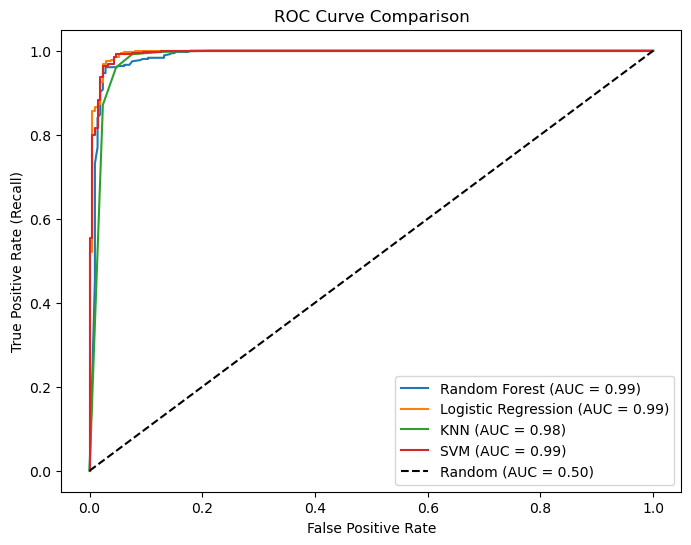

## 📖 صفحه ۱۴: مقایسه ROC Curve و AUC بین مدل‌ها

✍️ نویسنده: سیامک عباس‌نژاد

---

### 🔹 ROC Curve چیست؟

ROC (Receiver Operating Characteristic) یک نمودار است که:

* محور **X**: نرخ مثبت کاذب (False Positive Rate – FPR)
* محور **Y**: نرخ مثبت واقعی (True Positive Rate – TPR یا Recall)
  را نشان می‌دهد.

مدلی که عملکرد خوبی دارد، منحنی‌اش به گوشه بالا-چپ نزدیک‌تر است.

---

### 🔹 AUC (Area Under Curve)

* AUC = مساحت زیر منحنی ROC
* اگر AUC نزدیک به ۱ باشد → مدل بسیار قوی
* اگر AUC ≈ ۰.۵ باشد → مدل تقریباً تصادفی عمل می‌کند

---

### 🔹 کدنویسی: رسم ROC و محاسبه AUC

```python
from sklearn.metrics import roc_curve, auc

plt.figure(figsize=(8,6))

for name, model in models.items():
    # Cross-validated predictions (probabilities)
    y_pred_proba = cross_val_predict(model, X_scaled, y, cv=cv, method="predict_proba")[:,1]
    
    # Calculate ROC curve
    fpr, tpr, _ = roc_curve(y, y_pred_proba)
    roc_auc = auc(fpr, tpr)
    
    # Plot ROC curve
    plt.plot(fpr, tpr, label=f"{name} (AUC = {roc_auc:.2f})")

# Plot baseline (random model)
plt.plot([0,1], [0,1], 'k--', label="Random (AUC = 0.50)")

plt.xlabel("False Positive Rate")
plt.ylabel("True Positive Rate (Recall)")
plt.title("ROC Curve Comparison")
plt.legend(loc="lower right")
plt.show()
```
---

---

### 🔹 نمونه خروجی (مثال AUC)

| Model               | AUC  |
| ------------------- | ---- |
| Random Forest       | 0.99 |
| Logistic Regression | 0.99 |
| KNN                 | 0.98 |
| SVM                 | 0.99 |

---

### 🔹 تفسیر نتایج

* **Random Forest** بالاترین AUC را دارد (≈ 0.99) → بهترین قدرت تفکیک بیماران مثبت و منفی.
* **Logistic Regression** و **SVM** با AUC ≈ 0.99 رقابت نزدیکی دارند.
* **KNN** کمی ضعیف‌تر است (≈ 0.98).

---

### 🔹 نتیجه‌گیری

* ROC Curve دید بهتری نسبت به عملکرد مدل‌ها در سطوح مختلف آستانه (threshold) می‌دهد.
* AUC بالا برای همه مدل‌ها نشان‌دهنده کیفیت بسیار خوب این داده‌هاست.


