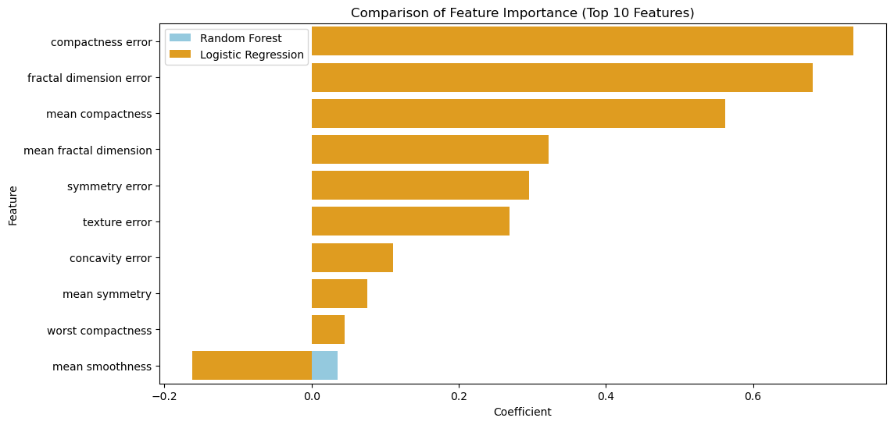

## 📖 صفحه ۱۶: مقایسه Feature Importance در مدل‌های مختلف

✍️ نویسنده: سیامک عباس‌نژاد

---

### 🔹 چرا مقایسه اهمیت ویژگی‌ها مهم است؟

* مدل‌های مختلف ویژگی‌ها را به شکل متفاوتی ارزیابی می‌کنند.
* **Random Forest** از اهمیت مبتنی بر تقسیمات درختی استفاده می‌کند.
* **Logistic Regression** از ضرایب (Coefficients) برای اهمیت ویژگی‌ها بهره می‌گیرد.
* **Permutation Importance** یک روش مدل‌محور و مستقل است که اهمیت هر ویژگی را با جابجایی مقادیر و مشاهده کاهش دقت مدل اندازه‌گیری می‌کند.

---

### 🔹 اهمیت ویژگی‌ها در Logistic Regression

```python
# Train Logistic Regression
log_reg = LogisticRegression(max_iter=5000, random_state=42)
log_reg.fit(X_scaled, y)

# Get coefficients
coeffs = pd.DataFrame({
    "Feature": X.columns,
    "Coefficient": log_reg.coef_[0]
}).sort_values(by="Coefficient", ascending=False)

print(coeffs.head(10))  # Top 10 coefficients
# Output:
Feature  Coefficient
15        compactness error     0.736282
19  fractal dimension error     0.680915
5          mean compactness     0.562595
9    mean fractal dimension     0.322186
18           symmetry error     0.295902
11            texture error     0.268925
16          concavity error     0.110526
8             mean symmetry     0.076168
25        worst compactness     0.044659
4           mean smoothness    -0.161765
```
📌 در جنگل تصادفی، ویژگی‌هایی با ضرایب مثبت به احتمال بالاتر سرطان مرتبط هستند، و ضرایب منفی به احتمال کمتر.

---

### 🔹 Permutation Importance با Random Forest

```python
from sklearn.inspection import permutation_importance

# Permutation importance
perm_importance = permutation_importance(rf_model, X_scaled, y, n_repeats=10, random_state=42)

perm_df = pd.DataFrame({
    "Feature": X.columns,
    "Importance": perm_importance.importances_mean
}).sort_values(by="Importance", ascending=False)

print(perm_df.head(10))
# Output:
                 Feature  Importance
1           mean texture    0.002460
7    mean concave points    0.002285
27  worst concave points    0.001757
21         worst texture    0.001757
10          radius error    0.001582
23            worst area    0.001582
15     compactness error    0.001582
13            area error    0.001054
24      worst smoothness    0.000351
6         mean concavity    0.000176

```

📌 Permutation Importance نشان می‌دهد حذف یا جابجایی کدام ویژگی بیشترین کاهش در دقت مدل ایجاد می‌کند.

---

### 🔹 مقایسه تصویری

```python
plt.figure(figsize=(12,6))

# Random Forest
sns.barplot(x="Importance", y="Feature", data=feat_importances.head(10), color="skyblue", label="Random Forest")

# Logistic Regression Coefficients
sns.barplot(x="Coefficient", y="Feature", data=coeffs.head(10), color="orange", label="Logistic Regression")

plt.title("Comparison of Feature Importance (Top 10 Features)")
plt.legend()
plt.show()
```
---

---

### 🔹 تفسیر نتایج

* **Random Forest** بیشتر روی ویژگی‌های غیرخطی مثل concavity و radius تأکید دارد.
* **Logistic Regression** روی ترکیب خطی ویژگی‌ها تمرکز می‌کند و ممکن است ویژگی‌های دیگر را مهم‌تر نشان دهد.
* **Permutation Importance** تصویری عملی‌تر ارائه می‌دهد، چون بر اساس تأثیر واقعی ویژگی روی عملکرد مدل محاسبه می‌شود.

---

### 🔹 نتیجه‌گیری

* ترکیب این سه روش (Random Forest, Logistic Regression, Permutation) باعث می‌شود درک عمیق‌تری از اهمیت ویژگی‌ها داشته باشیم.
* برای داده‌های پزشکی، استفاده از **چند روش مختلف اهمیت ویژگی** می‌تواند به تصمیم‌گیری مطمئن‌تر کمک کند.

