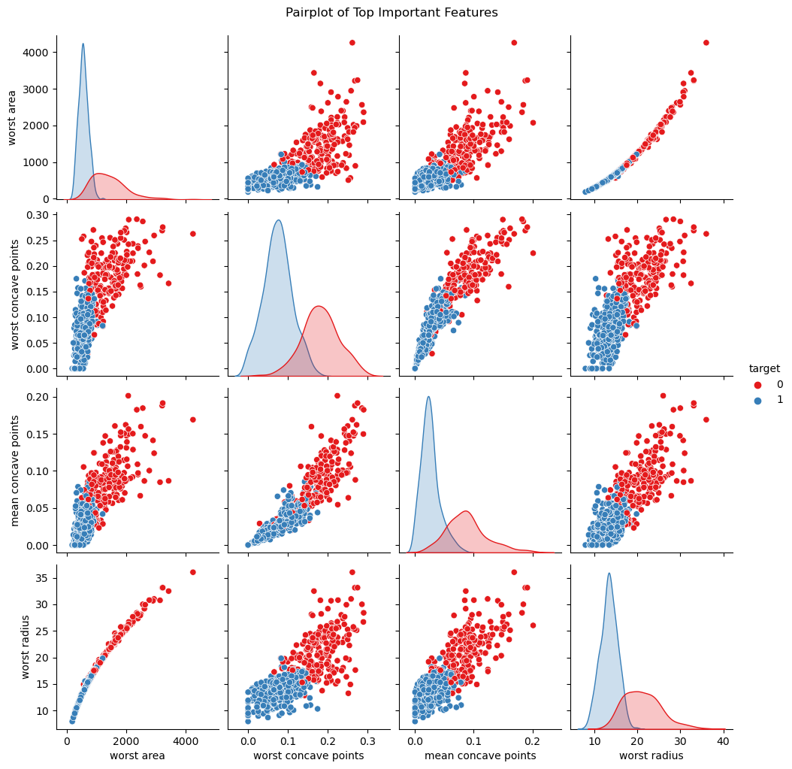
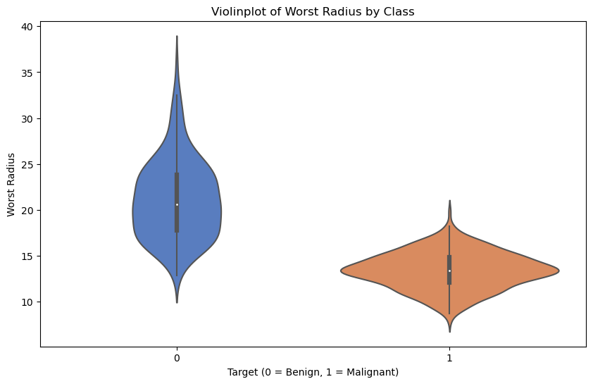
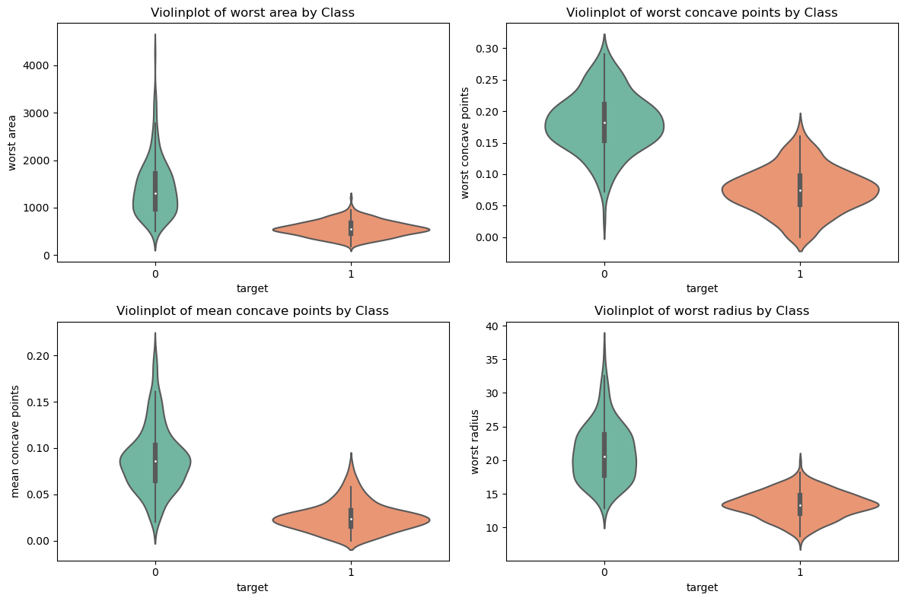

## 📖 صفحه ۱۷: تصویرسازی نهایی ویژگی‌های مهم

✍️ نویسنده: سیامک عباس‌نژاد

---

### 🔹 چرا تصویرسازی ویژگی‌های مهم؟

بعد از اینکه فهمیدیم کدام ویژگی‌ها بیشترین نقش را در تشخیص سرطان دارند، باید آن‌ها را **به صورت تصویری بررسی کنیم**. این کار کمک می‌کند:

1. ببینیم داده‌های مربوط به بیماران سالم و مبتلا چگونه در این ویژگی‌ها توزیع شده‌اند.
2. الگوهای قابل مشاهده (مانند جداشدگی کلاس‌ها) را بهتر درک کنیم.
3. تشخیص دهیم آیا ویژگی‌ها قابلیت جداسازی کلاس‌ها را دارند یا نه.

---

### 🔹 Pairplot برای ویژگی‌های مهم

```python
# Select top features based on Random Forest importance
top_features = feat_importances.head(4)["Feature"].tolist()

# Pairplot visualization
sns.pairplot(df, vars=top_features, hue="target", diag_kind="kde", palette="Set1")
plt.suptitle("Pairplot of Top Important Features", y=1.02)
plt.show()
```
---


---

📊 تفسیر:

---

- **`worst radius` و `worst area`**:  
  روند خطی قوی و تقاطع کم بین دو کلاس وجود دارد. این نشان‌دهنده این است که اندازه و مساحت حداکثری سلول در تشخیص سرطان نقش کلیدی دارند.

- **`worst concave points` و `mean concave points`**:  
  تداخل کم و الگوی روشنی بین دو گروه مشاهده می‌شود. این ویژگی‌ها نشان‌دهنده نابسامانی شکل سلول هستند و در سلول‌های بدخیم (Malignant) بیشتر هستند.

- **`worst area` vs `worst concave points`**:  
  نقاط Malignant در منطقه‌ای با مساحت بالا و خمیدگی زیاد قرار دارند. این نشان می‌دهد که سلول‌های بدخیم هم بزرگ‌تر و هم نابسامان‌تر هستند.

---

✅ این ویژگی‌ها به عنوان **شاخص‌های قوی برای تشخیص سرطان سینه** عمل می‌کنند.

---

### 🔹 Violinplot برای توزیع ویژگی‌ها

```python
plt.figure(figsize=(10,6))
sns.violinplot(x="target", y="worst radius", data=df, palette="muted")
plt.title("Violinplot of Worst Radius by Class")
plt.xlabel("Target (0 = Benign, 1 = Malignant)")
plt.ylabel("Worst Radius")
plt.show()
```
---

---
📊 تفسیر:

* بیماران Malignant معمولاً **worst radius** بالاتری دارند.
* شکل ویولن نشان می‌دهد توزیع داده‌ها در دو کلاس بسیار متفاوت است.

---

### 🔹 ترکیب چند Violinplot برای ویژگی‌های کلیدی

```python
plt.figure(figsize=(12,8))
for i, feature in enumerate(top_features, 1):
    plt.subplot(2,2,i)
    sns.violinplot(x="target", y=feature, data=df, palette="Set2")
    plt.title(f"Violinplot of {feature} by Class")
plt.tight_layout()
plt.show()
```
---


---

📊 تفسیر:

* برخی ویژگی‌ها مثل worst area توزیع‌های بسیار متمایز دارند، اما برخی دیگر مثل concave points تداخل دارند. با این حال، ترکیب این ویژگی‌ها به مدل Random Forest کمک می‌کند تا با دقت بالا تشخیص دهد

---

### 🔹 نتیجه‌گیری

* Pairplot و Violinplot ابزارهای قدرتمندی برای بررسی **جداسازی کلاس‌ها** بر اساس ویژگی‌های مهم هستند.
* داده‌ها نشان می‌دهند که برخی ویژگی‌ها واقعاً قدرت پیش‌بینی بالایی دارند.
* این تحلیل تصویری درک ما از مدل و داده‌ها را عمیق‌تر می‌کند و برای دانشجویان و پژوهشگران بسیار آموزنده است.

